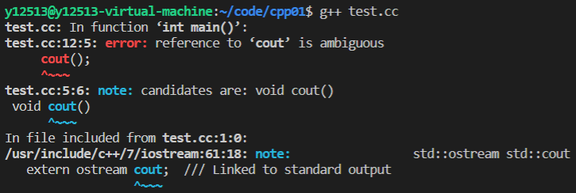
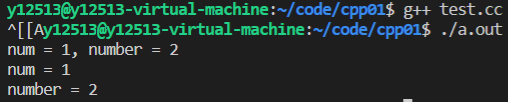
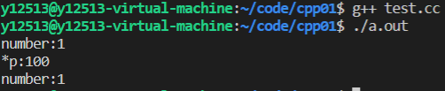
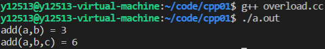
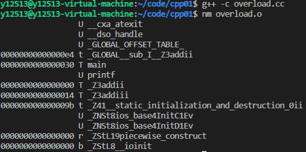
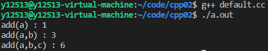
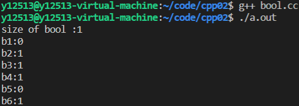
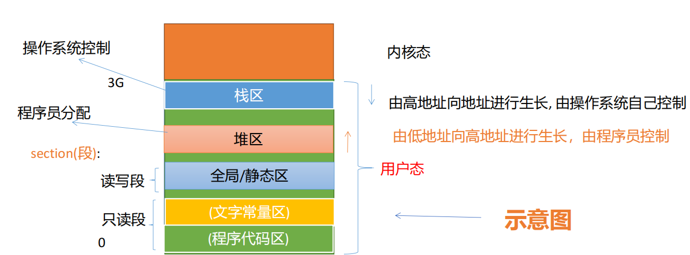

# 代码风格

这里写点上课时不时会提到得代码格式（属于不定期补充的那种）

本人强迫症 这个部分重要程度绝对是**t0**

## 命名

现在流行的命名方式两种，单词之间加下划线_；或是驼峰命名法——如果变量名字为多个单词那么单词首字母大写，如：AddResult

```c++
int myStudentCount;// 小驼峰法，即第一个字母小写，常用于变量、函数名
class DataBassUser;// 大驼峰法，开头字母全大写，常用于类，属性，命名空间等
char *my_first_name;// 下划线法，都小写
```

## 格式

在命名空间中实体都顶格写 不需要缩进

### 类和函数的定义写在头文件中，函数实现新开一个源文件写

```c++
//head.hh

class Template(){
public:
    
    void func1();
    
    void func2();
    
    void func3();

private:
    
    int _iA;
    double _iB;
    char _iC[100];
};
```

```c++
//head.cc

#include"head.hh"

void Template::func1(){
    ......;
}

void Template::func2(){
    ......;
}

void Template::func3(){
    ......;
}
```

### 增添头文件的顺序：

```c++
#include"head.hh"  //先增加自定义的头文件

#include<iostream> //再增加C++的头文件

#include<stdio.h>  //然后增加C的头文件

#include<log4cpp/Category.hh>//最后增加第三方库的头文件
```

为什么这么有讲究呢，因为编译时是先从当前目录进行查找，之后再从系统目录进行查找，而且头文件乱放出问题基本找不出原因

# C++ 前置

1.文件后缀 .cc(linux下) or .cpp(windows下)

2.编译指令

​    $ gcc *.cc [-o name]

3.instal

​    $sudo apt install g++

# 命名空间

## namespace 

作用：解决命名冲突

```c++
namespace name
{
int number = 1;

void test(){
    
}//end of tese
}//end of name 
```

==在命名空间中定义的统称为实体（包括变量和函数）==

==命名空间的代码顶格，不需要缩进==

## 使用命名空间

三种方式

### 使用作用域限定符:: ，限定符前为命名空间的名字，后面为命名空间中的实体

```c++
namespace name
{
int number = 1;

void test(){
    
}//end of tese
}//end of name 

int main(){
    name::number = 1;
    name::test();
}
```

### 用using编译指令一次性把命名空间中的实体全部引入

```c++
namespace name
{
int number = 1;

void test(){
    
}//end of tese
}//end of name 

using namespace name;

int main(){
    number = 1;
    test();
}
```

### 可以使用using对单个实体进行使用

```c++
#include<iostream>
//using namespace std;
using std::cout;//使用std里的cout
using std::endl;//使用std里的endl

int main(){
    cout<<"hello world"<<endl;
    
    return 0;
}
```

可以只using std里的cout和endl这两个实体（反正其他没用的话）

## using 会造成的定义冲突

```c++
#include<iostream>

using namespace std;

void cout(){ //哎呀，我不知道std里面有cout耶，哎嘿
    printf("\n");
}

int main(){
    cout();
    
    return 0;
}
```



'cout' is ambiguous

因为命名空间std中已经包含了我们常用的cout，此时再另外声明会出现问题

所以在不知道命名空间中会出现什么实体的情况下大力推荐使用第三种using

## 命名空间的嵌套使用

可以在一个命名空间中再namespace一个命名空间

```c++
namespace wd
{

int num = 1;
    
void display(){
    printf("num = %d\n", num);
}    

namespace cteam
{
int number = 2;

void display(){
    printf("number = %d\n", number);
}
    
}//end of namespace cteam
}//end of namespace wd
```

当然调用实体的时候要一层一层调用(就像写快递地址一样)

```c++
int main(){
    printf("num = %d, number = %d\n", wd::num, wd::cteam::number);
    
    wd::display();
    wd::cteam::display();
    
    return 0;
}
```



## 命名空间是否只可以定义一次

函数是只能定义一次

```c++
int add(int，int)；
int add(int a,int b){
    return a+b;
}
```

命名空间也是这样吗，当然不是

```c++
namespace wd
{

int num = 1;
    
void display(){
    printf("num = %d\n", num);
}    

namespace cteam
{
int number = 2;

void display(){
    printf("number = %d\n", number);
}
    
}//end of namespace cteam
}//end of namespace wd

namespace wd
{
int number=3;
    
void show(){
    printf("number = %d\n",number);
}
    
}//end of namespace wd
```

再次定义命名空间会将新的命名空间中定义的实体加入进去

命名空间就像黑洞，可以无限吸收新的实体

## 匿名空间

c++作为c的超集当然兼容c的头文件

那么调用c的库函数时会存放在==匿名空间==中

```c++
::printf();
```

模块：单个c，c++文件

但是匿名空间中的实体也只能在本模块中使用

同理静态变量 static ，静态函数也只能在本模块中调用

全局变量extern则可以跨模块调用，但是匿名空间的全局变量也只能在本模块中调用

# const关键字

上面提到过静态变量static，全局变量extern

还剩下一个常量const

const修饰的常量不能修改其值，使这个变量具有只读属性，定义的时候一定要赋值，否则会报错

## const修饰指针

有三种情况

### const int *P

```c++
int a = 1;
int b = 10;
const int *p = &a;
p = &b;  //ok     可以改变指向
*p = 100;//error  不可以改变指针所指变量的值
```

### int * const p 

```c++
int a = 1;
int b = 10;
int * const p = &a;
p = &b;  //error 不可以改变指向
*p = 100;//ok    可以改变指针所指变量的值
```

### int const * const p

```c++
int a = 1;
int b = 10;
int const * const p = &a;
p = &b;  //error
*p = 100;//error
```

# NEW / DELETE

## c++中申请内存空间

c语言中使用malloc / calloc申请内存，使用free释放内存

c++中使用new申请内存，使用delete释放内存

==都需要成对使用，防止发生内存泄露==

```c++
void test(){
    int *p = new int(10);//给*p赋值10
    delete p;//回收p
    
    //上面是只有单个变量，下面演示数组
    
    int * arr = new int[10]();//小括号内填值进行初始化 中括号内填元素的大小
    delete [] arr;//回收整个数组的空间，需要加[]，不加会报错
}
```

## 与c的异同

### 相同点：

都用来申请堆空间

必须成对出现，否则会发生内存泄漏

### 不同点：

new/delete是C++的表达式，malloc/free是C的库函数

new在开辟空间时可以初始化空间，malloc只能申请空间，不能初始化

# 引用REFERENCE

reference 本质上就是一个变量的别名。

与某一个实体绑定到一起，对引用的修改就是对变量的修改

```c++
void tese(){
    int num = 1;
    int & ref = num;//ref就是num的别名 对ref的操作就是对num的操作
}
```

引用本身不能单独存在（虚空索敌吗），必须绑定一个实体，一经绑定不能改变对象

右值没法取地址

```c++
void test(){
    int & ref = 1;//error 非const引用不能绑定到一个右值,因为这个值不在内存中
    const int & ref2 = 1;//ok
}
```

**引用的底层实现是指针常量**，他的出现就是减少指针的使用


定义 类型 & ref =变量

&的用法：

​    ==取地址==

​    按位与

​    引用符号


## 引用作为函数的参数

```c++
void swap(int & x, int & y){
    int tmp = x;
    x = y;
    y = temp;
}
//调用函数时可以直接作用于x，y 交换变量的值
```

优势：直观，不需要为参数开辟额外的空间，不需要进行复制，这样提高程序的执行效率

## 引用作为函数的返回值

```c++
int arr[5] = {1, 2, 3, 4, 5};

int & getVal(int i){
    return arr[i];
}//会直接调用全局变量，不会进行复制，从而节省开销

int main(){
    getVal(1) = 10;//直接对arr[1]进行赋值
    
    return 0;
}
```

与普通函数返回值对比，没有复制开销

这种写法返回的变量一定要大于函数的生命周期

## 不能返回局部变量的引用

```c++
int & test(){
    int number = 1;
    return number;
}
```

编译时会有警告

运行时会发生==段错误==

## 不要轻易返回一个堆空间变量（指针）的引用

返回堆空间引用，但是有内存泄漏，如果非要这么做，必须有内存回收机制

```c++
int & func2(){
    int *p = new int(10);
    return *p;
}
```

调用的人如果不知道返回的是指针100%会发生内存泄漏（星空：完全救不回来）

## 引用与指针的异同

既然引用的底层实现是常量指针，那么引用与指针的异同是什么？

### 相同点：

都是地址的概念；

指针指向一块内存，它的内容是所指内存的地址；引用是某块内存的别名。

### 区别：

指针是一个实体，而引用仅是个别名；

引用使用时无需解引用(*)，指针需要解引用；

引用只能在定义时被初始化一次，之后不可变；指针可变；

引用没有 const，指针有 const；

引用不能为空，指针可以为空；

“sizeof 引用”得到的是所指向的变量(对象)的大小，而“sizeof 指针”得到的是指针本身(所指向的变量或对象的地址)的大小；

指针和引用的自增(++)运算意义不一样；

从内存分配上看：程序为指针变量分配内存区域，而引用不需要分配内存区域。

# 强制转换

C和C++都有强制转换的写法

## C

```C
TYPE a = (TYPE) EXPRESSION
```

C的转换比较随意，啥都能转，比如你可以把一个指向const对象的指针转换成指向非const对象的指针。

## C++

C++将强制转换分成了不同的情况来讨论

### static_cast

最常用的转换，在指针之间做转换，经常就是在（void *）和其他（type *）类型之间的指针做转换

```c++
void test(){
    int iNumber = 100； 
    float fNumber = 0； 
    fNumber = (float) iNumber；//C风格 
    fNumber = static_cast<float>(iNumber);//c++风格
        
    void *pVoid = malloc(sizeof(int)); 
    int *pInt = static_cast<int*>(pVoid); 
    *pInt = 1;
}
```

可以用$ grep (文件名.cc) * -n 来查找强制转换的位置

### const_cast

去除常量属性，一般情况下不太推荐使用（下面这个实例，学了以后忘掉就行😂）

```c++
void func(int * p){
    *p = 100;
    cout << "*p:" << *p << endl;
}

void test(){
    const int number = 1;
    cout << "number:" << number << endl;
    // number:1
    func(const_cast<int *>(&number));
    // *p:100
    cout << "number:" << number << endl;
    // number:1
}
```



可以发现number的值经历过func()函数以后并没有变成100，这是const_cast比较特别的地方

取消了const，但没有完全取消

所以这么反直觉的函数一般情况下不建议使用，免得真有人以为能把const取消

### dynamic_cast

用在派生类与基类之间做转换，等我学了多态与继承再回来补充

### reinterpret_cast

在任意类型间做转换，跟C差不多，不常用，不做介绍

# 函数重载

当函数名字相同，返回值类型相同，但参数不同，称为函数重载

实现原理：名字改编（name mangling）

具体步骤：当函数名相同时，会根据函数参数的类型、顺序、个数不同进行改编


这里是c所没有的最新最劲爆最hot的写法

```c++
int add(int x, int y){
    return x + y;
}

int add(int x, int y, int z){ // overload
    return x + y + z;
}

int main(){
    int a = 1, b = 2, c = 3;
    printf("add(a,b) = %d\n", add(a,b));
    printf("add(a,b,c) = %d\n", add(a,b,c));
    
    return 0;
}
```




让我在编译时加上-c来看看编译时发生了什么



可以发现有有两个函数

_Z3addii

_Z3addiii

将add函数改编后，以C++的方式进行了调用

# extern "C" ：C++和C混合编程

刚才讲了函数重载，但是这是C++区别于C独有的写法

那么，当有奇怪的需求，比如说想用C的方式进行函数调用该怎么操作呢

将这些代码加入到extern "C"{}大括号范围内

```c++
extern "C"
{
    
int add(int x, int y){
    return x + y;
}
    
}//end of extern C
```

那么在extern "C"范围内的函数会以C的方式进行调用，不会进行函数改编

C++和C进行混合编程就是这样的


但我这个懒鬼想直接把代码复制到C文件中，但是extern "C"又不是C的函数

怎么识别编译环境来做到兼容性更高呢

来做点小优化

```c++
#ifdef __cplusplus  //这是只在C++编译环境下才有的宏，C编译环境下没有
extern "C"
{
#endif
    
int add(int x, int y){
    return x + y;
}

#ifdef __cplusplus
}//end of extern C
#endif
```

只要在C++的函数前增加识别编译环境的语句就行

直接复制到C文件中也可以跑通

# 默认参数

写函数的时候经常会传不止一个参数进去，但是往往好几次调用只有一两次会改变一下参数，有什么办法可以省事呢

```c++
int add(int x, int y = 0, int z = 0){
    return x + y + z;
}

int main(){
    int a = 1, b = 2, c = 3;
    cout << "add(a) : " << add(a) << endl;
    cout << "add(a,b) : " << add(a,b) << endl;
    cout << "add(a,b,c) : " << add(a,b,c) << endl;
}
```



 函数中设置默认参数默认从最右边开始，可以所有参数都设置默认参数，但不支持只设中间参数的写法

```c++
int add(int x, int y, int z = 0); //ok
int add(int x, int y = 0, int z); //error
int add(int x = 0, int y = 0, int z = 0); //ok
```

所以记得把最不常用的缺省参数放最右

如果是将函数的声明和实现分开，那么==将默认参数写在声明中，实现的时候不写==，否则会报错

```c++
int add(int x = 0, int y = 0, int z = 0)；
    
int main(){
    int a = 1, b = 2, c = 3;
    cout << "add(a) : " << add(a) << endl;
    cout << "add(a,b) : " << add(a,b) << endl;
    cout << "add(a,b,c) : " << add(a,b,c) << endl;
}

int add(int x, int y, int z){
    return x + y + z;
}
```

# bool

（我怎么记得C里也有bool类型来着）

不是1就是0的类型，没什么好多说的，直接上实例把


```c++
void test(){
    bool b1 = 0;
    bool b2 = 1;
    bool b3 = 3;
    bool b4 = true;
    bool b5 = false;
    bool b6 = -1;
    cout << "size of bool :" << sizeof(bool) << endl;
    cout << "b1:" << b1 << endl
         << "b2:" << b2 << endl
         << "b3:" << b3 << endl
         << "b4:" << b4 << endl
         << "b5:" << b5 << endl
         << "b6:" << b6 << endl;
}
```



0就是0，非0都是1

# inline

C++提出了inline函数，inline函数在编译时，进行语句的替换，功能与宏函数类似

==inline要放在头文件中，即声明函数之前加上inline，而且必须要实现，不能单独开一个模块来实现==

```c++
//add.hpp

inline int add(int x, int y){
    return x + y;
}
```

inline可以像宏定义那样做到直接替换从而节省调用函数的开销

但是当函数内部过大或是函数内有循环的话不建议使用inline，会造成代码膨胀，导致收益并不高


# 内存布局

~~怎么说这都是我最讨厌的一块，毕竟我的脑子又不是内存条的形状~~

==为了面试复习，冲！==

这部分跟C的差不多

以32位系统为例，一个进程（用户态）在执行的时候，能够访问的是虚拟地址空间



栈区：放函数、普通变量的

堆区：放malloc、new开辟的出来的变量

全局、静态区：static这些变量放这


对这些感兴趣不如直接%p打印一下变量的位置就好

