# 面向对象

C是面向过程的，C++是面向对象的，中间到底经历了什么能有如此改变呢

## 面向过程

之前写C的网盘项目，都是手搓一个一个函数封装好，写好实现，最后在main里面调用，这是由函数+数据结构所完成的一个项目，也就是面向过程

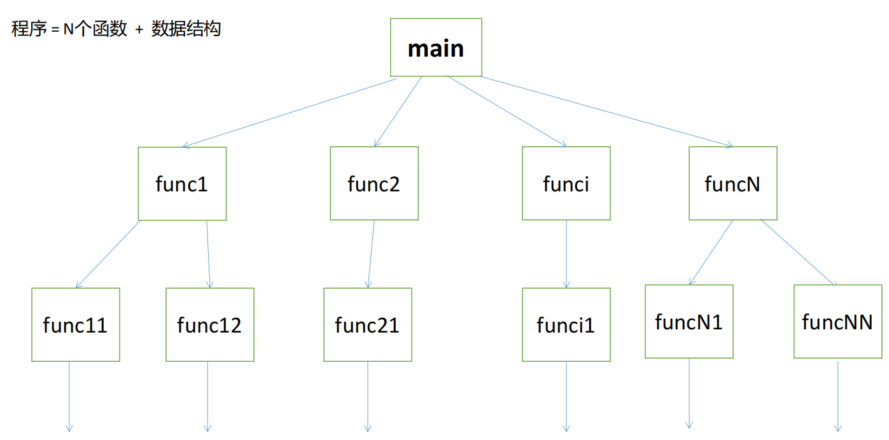

## 面向对象

对象：属性+行为

几个对象之间的属性之间进行交互，导致对象的状态发生变化

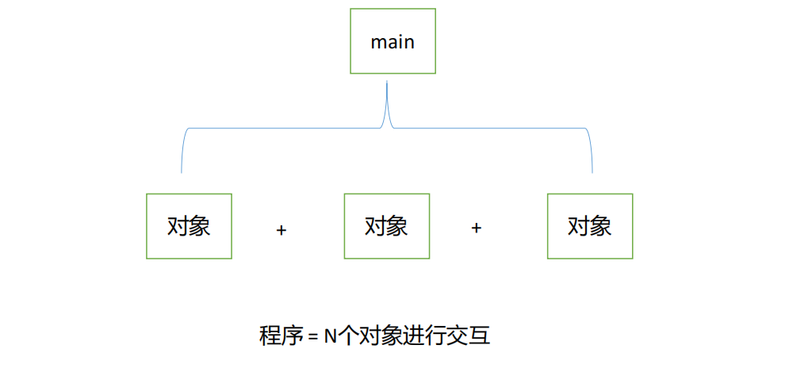

本质特征：消息传递

三大特性：封装、继承、多态

# class

## 定义类

具有相同的属性和行为的对象提取出一个类（class）

属性在C++的类中称为数据成员

行为在C++的类中称为成员函数或方法(method)

```c++
class Person //类命的首字母建议大写
{
    void pay();//成员函数
    void get();
    
    char name[20];//数据成员
    int id;
    float money;
};// 这里有个分号不要忘了
```

大括号的内部称为类内部

类的成员是有属性的，如果不定义，默认为私有（private），会让类之外无法调用

```c++
#include <iostream>
#include <string.h>

using namespace std;

class Computer
{
    //类的内部，默认情况下是私有（private）
public: //类对外提供的接口、功能、服务
    void setBrand(const char *brand)
    {
        strcpy(_brand, brand);
    }

    void setPrice(double price)
    {
        _price = price;
    }

    void print()
    {
        cout << "brand:" << _brand << endl
             << "price:" << _price << endl;
    }

private: //放在私有区域的成员，不希望在类之外访问
    char _brand[20];
    double _price;
};

void test()
{
    int a;
    Computer c;

    c.setBrand("小米");
    c.setPrice(6999); // 6999交个朋友
    c.print();
}

int main()
{
    test();

    return 0;
}
```

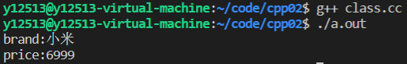

## 当然类的函数可以在外部实现

```c++
//Computer.hh

#include <iostream>
#include <string.h>

using namespace std;

class Computer
{
    //类的内部，默认情况下是私有（private）
public: //类对外提供的接口、功能、服务
    void setBrand(const char *brand);

    void setPrice(double price);

    void print();

private: //放在私有区域的成员，不希望在类之外访问
    char _brand[20];
    double _price;
};
```

```c++
//Computer.cc

#include"Computer.hh"
//使用作用域限定符：：来调用类中的函数
Void Computer::setBrand(const char *brand){
    strcpy(_brand, brand);
}

Void Computer::setPrice(double price){
    _price = price;
}

Void Computer::print(){
    cout << "brand:" << _brand << endl
         << "price:" << _price << endl;
}
```

大的项目中推荐这种写法

## 构造函数

定义类的时候没有构造函数（即没有给类中的变量赋值的函数）时，会生成一个默认构造函数


**构造函数**有一些独特的地方：

1.==函数的名字与类名相同==

2.没有返回值

3.没有返回类型，即使是void也不能有


### 默认无参构造函数

构造函数在对象创建时自动调用，用以完成对象成员变量等的初始化及其他操作(如为指针成员动态申请内存等)；如果程序员没有显式定义它，系统会提供一个默认构造函数。

```c++
class Point
{
public:
    void print(){
        cout << "(" << _ix << "," << _iy << ")" << endl;
    }
    //当类中没有显示定义的函数时，系统会生成一个默认构造函数
private:
    int _ix;
    int _iy;
};

void test(){
    Point pt;
    pt.print();
}
```

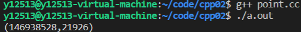


那么，当我们自己定义构造函数时会发生什么

```c++
class Point
{
public:
    Point(int ix, int iy)//显示定义有参构造函数
    {
        _ix = ix;
        _iy = iy;
    }

    void print()
    {
        cout << "(" << _ix << "," << _iy << ")" << endl;
    }
   
private:
    int _ix;
    int _iy;
};

void test()
{
    Point pt;
    pt.print();
}
```

答案是报错：

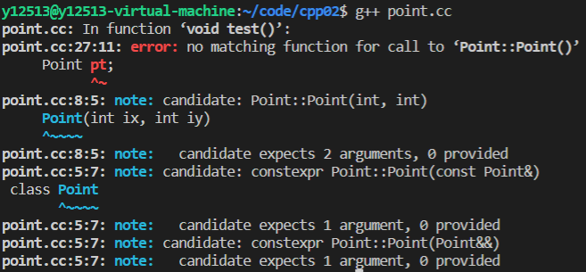

这个报错也太多了，让我们看看ide是怎么说的：

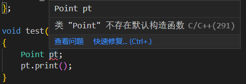

这说明了构造函数是可以重载的，但是这样编译不给过，因为不给无参构造函数了

### 显式定义一个构造函数

```c++
class Point
{
public:
    Point()//显式定义无参构造函数
    {
        cout << "Point()" << endl;
        _ix = 0;
        _iy = 0;
    }

    Point(int ix, int iy)//定义有参构造函数
    {
        _ix = ix;
        _iy = iy;
    }

    void print()
    {
        cout << "(" << _ix << "," << _iy << ")" << endl;
    }

private:
    int _ix;
    int _iy;
};

void test()
{
    Point pt;
    pt.print();

    Point pt2(2, 2);//甚至可以直接初始化新类！！！！！！！！！！！！
    pt2.print();
}

```

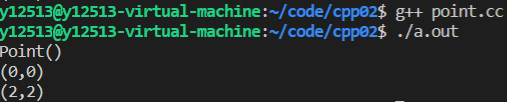


### 更加地道的写法

```c++
class Point
{
public:
    Point()
    : _ix(0)
    , _iy(0) //初始化表达式（初始化列表）
    {
    }

    Point(int ix, int iy)
    {
        _ix = ix;
        _iy = iy;
    }

    void print()
    {
        cout << "(" << _ix << "," << _iy << ")" << endl;
    }

private:
    int _ix;
    int _iy;
};
```

==这是C++独有的写法，别的语言没有==，在定义变量时可以直接在变量后加（）并在其中填入数值进行初始化，比如

```c+=
int b(1);

// b == 1
```

## 初始化表达式 

如果初始化的数据成员有数值关联会如何

```c++
lass Point
{
public:
    Point(int x)
        : _iy(x)     //_iy = x
        , _ix(_iy)   //_ix = _iy
    {
    }
    
    void print()
    {
        cout << "(" << _ix << "," << _iy << ")" << endl;
    }

private:
    int _ix;
    int _iy;
};

void test()
{
    Point pt(1);
    pt.print();
}
```

按照我们的想法是不是应该是先 _iy = 1，然后 _ix = _iy = 1

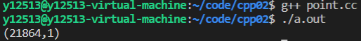

好像_iy是初始化成功了， _ix的值却不是我们想要的

问题出在这，数据成员初始化的顺序，只与其在类中被声明时的顺序有关，而 

与其在初始化表达式中的顺序无关。

## 析构函数

构造函数在创建对象时被系统自动调用，而析构函数(Destructor)在对象被撤销时被自动调用，相比构造

函数，析构函数要简单的多。

### 析构函数的特点：

1.==与类同名，之前冠以波浪号，以区别于构造函数。==

2.析构函数没有返回类型，也不能指定参数。因此，析构函数只能有一个，不能被重载。

3.对象超出其作用域被销毁时，析构函数会被自动调用。

### 析构函数在哪些情况下被调用：

对象被销毁的时候 

​    1.栈对象 

​    2.全局对象 

​    3.静态对象 

​    4.堆对象在执行delete表达式时，会自动调用析构函数


### 手写析构函数

那么我在申请堆空间（指针 malloc/new ）的资源的时候不会被析构函数所回收

那只能自己手写了

```c++
class Computer
{
public:
    Computer(const char *brand, double price)
        : _brand(new char[strlen(brand) + 1]())
        , _price(price)
    {
        cout << "Computer(const char *, double)" << endl;
    }
    
    ~Computer()// 显示定义析构函数
    {
        cout << "~Computer()" << endl;
        delete[] _brand;
        _brand = nullptr;
    }

private:
    char *_brand;
    double _price;
};
```

以上的Computer中，有一个数据成员是指针，而该指针在构造函数中初始化时已经申请了堆空间的资源，则当对象被销毁时，必须回收其资源。此时，编译器提供的默认析构函数是没有做回收操作的，因此就不再满足我们的需求，我们必须显式定义一个析构函数，在函数体内回收资源。

## 拷贝构造函数

我们经常会用一个变量初始化另一个变量

```c++
int a(1);
int b(a);
```

那么，类也能这么做吗

拷贝构造函数的结构

```c++
类名(const 类名 &);
```

来个实例

```c++
class Point
{
public:
    Point()
    : _ix(0)
    , _iy(0) //初始化表达式（初始化列表）
    {
    }

    Point(int ix, int iy)
    {
        _ix = ix;
        _iy = iy;
    }
    
    Point(const Point & rhs)// 拷贝构造函数
    : _ix(rhs._ix)
    , _iy(rhs._iy)
    {
     
    }

    void print()
    {
        cout << "(" << _ix << "," << _iy << ")" << endl;
    }

private:
    int _ix;
    int _iy;
};

void test()
{
    Point pt(1,1);
    pt.print();
    
    Point pt2(pt);
    pt2.print();
}
```

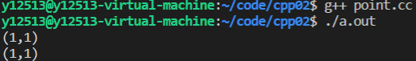

当然我定义的Point类足够简单，只有两个int型变量，这拷贝构造函数也==不需要手动去写，编译器默认提供==

### 浅拷贝

回到我们的Computer类，那个类中有一个字符指针，当它拷贝时会发生什么

```c++
#include <iostream>
#include <string.h>

using namespace std;

class Computer
{
public:
    Computer(const char *brand, double price)
        : _brand(new char[strlen(brand) + 1]()), _price(price)
    {
        cout << "Computer(const char *, double)" << endl;
        strcpy(_brand, brand);
    }

    ~Computer()
    {
        cout << "~Computer()" << endl;
        delete[] _brand;
        _brand = nullptr;
    }

    Computer(const Computer &rhs)
        : _brand(rhs._brand), _price(rhs._price)
    {
    }

    void print()
    {
        cout << "brand:" << _brand << endl
             << "price:" << _price << endl;
    }

private:
    char *_brand;
    double _price;
};

int main(int argc, char *argv[])
{
    Computer pc1("Huawei Matebook14", 5699);
    pc1.print();

    Computer pc2(pc1);
    pc2.print();

    return 0;
}

```

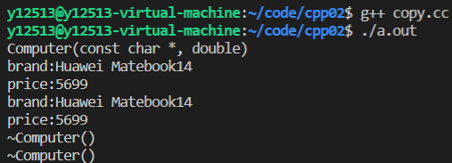

这里我无论如何都试不出段错误，同样的代码，老师上课时就会有报错

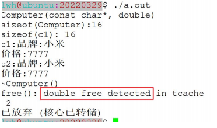

这里free了两次 _brand ，第二次找不的pc2的 _brand 位置

在拷贝时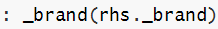从上面的定义来看，pc与pc对象的数据成员_brand都会指向同一个堆空间的字符串，并未进行数值复制，这种只拷贝指针地址的方式，我们称为**浅拷贝**。当其中一个对象被销毁时，另外一个对象就获取不到相应的brand值了。

### 深拷贝

此时需要重新显式定义拷贝构造函数，让两个指针不指向同一块堆空间

```c++
Computer(const Computer & rhs) 
: _brand(new char[strlen(rhs._brand) + 1]()) //不再用原对象的地址
, _price(rhs._price) 
{ 
strcpy(_brand, rhs._brand); 
}
```

这种拷贝指针所指空间内容的方式，我们称为**深拷贝**。因为两个对象都拥有各自的独立堆空间字符串，一个对象销毁时就不会影响另一个对象。

### 调用拷贝构造函数的时机

1.当一个已经存在的对象初始化另一个新对象时，会调用拷贝构造函数

2.当实参和形参都是对象，进行实参与形参结合时，会调用拷贝构造函数

3.当函数的返回值是对象，函数调用完成返时，会调用拷贝构造函数(优化选项-fno-elide-constructors)

## 赋值运算

默认：浅拷贝

手写深拷贝：

```c++
Computer &Computer::operator=(const Computer &rhs) { 
    if(this != &rhs) //1、自复制
    { 
        delete [] _brand; //2、释放左操作数 
        _brand = nullptr; 
        
        _brand = new char[strlen(rhs._brand) + 1](); //3、深拷贝 
        strcpy(_brand, rhs._brand);
        
        _price = rhs._price; 
    }
    return *this; //4、返回*this 
}
```


## *this指针

实在类中定义的非静态成员函数中都有一个隐含的this指针，它代表的就是当前对象本身，它作为成员函数的第一个参数，由编译器自动补全。

函数体内所有对类数据成员的访问， 都会被转化为this->数据成员的方式。

