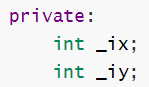
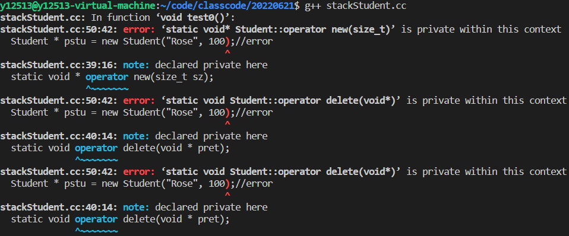
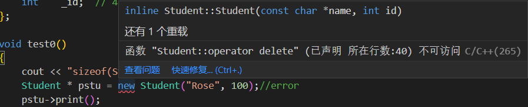
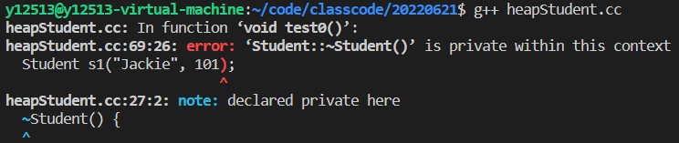
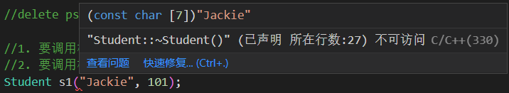

# 面向对象

C是面向过程的，C++是面向对象的，中间到底经历了什么能有如此改变呢

## 面向过程

之前写C的网盘项目，都是手搓一个一个函数封装好，写好实现，最后在main里面调用，这是由函数+数据结构所完成的一个项目，也就是面向过程


## 面向对象

对象：属性+行为

几个对象之间的属性之间进行交互，导致对象的状态发生变化


本质特征：消息传递

三大特性：封装、继承、多态

# class

## 定义类

具有相同的属性和行为的对象提取出一个类（class）

属性在C++的类中称为数据成员

行为在C++的类中称为成员函数或方法(method)

```c++
class Person //类命的首字母建议大写
{
    void pay();//成员函数
    void get();
    
    char name[20];//数据成员
    int id;
    float money;
};// 这里有个分号不要忘了
```

大括号的内部称为类内部

类的成员是有属性的，如果不定义，默认为私有（private），会让类之外无法调用

```c++
#include <iostream>
#include <string.h>

using namespace std;

class Computer
{
    //类的内部，默认情况下是私有（private）
public: //类对外提供的接口、功能、服务
    void setBrand(const char *brand)
    {
        strcpy(_brand, brand);
    }

    void setPrice(double price)
    {
        _price = price;
    }

    void print()
    {
        cout << "brand:" << _brand << endl
             << "price:" << _price << endl;
    }

private: //放在私有区域的成员，不希望在类之外访问
    char _brand[20];
    double _price;
};

void test()
{
    int a;
    Computer c;

    c.setBrand("小米");
    c.setPrice(6999); // 6999交个朋友
    c.print();
}

int main()
{
    test();

    return 0;
}
```


### 特殊数据成员

#### const数据成员

由于const的只读属性，在类初始化结束后，不能再修改

初始化时不能使用赋值语句进行初始化，它们只能在构造函数初始化列表中进行初始化

```c++
class Point 
{
public: 
    //错误写法 
    Point(int ix = 0, int iy = 0) 
    { 
        _ix = ix;//error, 这是赋值语句，const成员不能修改
        _iy = iy;//error 
        _iz = _ix; 
    }
    
    //正确写法 
    Point(int ix = 0, int iy = 0) 
    : _ix(ix) 
    , _iy(iy) 
    , _iz(_ix) 
    {

     } 

private: 
    const int _ix; 
    const int _iy; 
    int & _iz; 
};
```


#### 引用成员

绑定某一个对象

和常量成员相同，引用成员也必须在构造函数初始化列表中进行初始化，否则编译报错。


#### 子对象成员

当我的类中数据成员需要别的类时，比如说类Line里要两个Point类（两点确定一条直线），对Point对象的创建就必须要放在line的构造函数的初始化列表中进行

```c++
class Line
{
public:
    Line(int x1, int y1, int x2, int y2)
    : _pt1(x1, y1)
    , _pt2(x2, y2)
    {
        cout << "Line(int ,int ,int ,int)" << endl;
    }
    
private:
    Point _pt1;
    Point _pt2;
};
```


#### 静态数据成员

1.在某一个数据成员之前加上static关键字 

2.==存储在全局静态区，并不占用对象的存储空间== 

3.静态数据成员被==整个类的所有对象所共享== 

4.静态数据成员的==初始化必须要放在类之外进行==

```c++
class Computer 
{
public: 
    Computer(const char *brand, double price) 
    : _brand(new char[strlen(brand) + 1]()) 
    , _price(price) 
    { 
        _totalPrice += _price; //构造时总价格自动加上所有Computer类的价格
    }
    
    void print() { 
        cout << "品牌:" << _brand << endl 
             << "价格:" << _price << endl 
             << "总价:" << _totalPrice << endl; 
    }

//... 
private: 
    char * _brand; 
    double _price; 
    static double _totalPrice; //所有Computer类共享总价格
};

double Computer::_totalPrice = 0;    //在类之外进行静态数据成员的初始化
```


### 特殊成员函数


#### 静态成员函数

形式： 在普通成员函数前加上static关键字 


特点：

1.静态成员函数没有隐含的==this指针== 

2.不能访问非静态的数据成员 

3.不能访问非静态的成员函数 

4.==只能访问静态的数据成员和成员函数==


```c++
class Computer
{
public:
    Computer(const char *brand, double price)
        : _brand(new char[strlen(brand) + 1]()), _price(price)
    {
        _totalPrice += _price;
    }

    //...
    static void printTotalPrice()
    {
        cout << "总价:" << _totalPrice << endl;//类中静态函数只能访问静态函数或变量
    }
    //...
    void print() { 
        cout << "品牌:" << _brand << endl 
             << "价格:" << _price << endl 
             << "总价:" << _totalPrice << endl; 
    }

private:
    char *_brand;
    double _price;
    static double _totalPrice;
};

int main(void)
{
    Computer pc1("Huawei MateBook14", 5699);
    pc1.print();
    Computer::printTotalPrice(); //可以通过类名直接调用 
    return 0; 
}
```


#### const成员函数

形式：是在函数的参数列表之后，大括号(函数执行体)之前的位 置，加上const关键字，该函数就称为const成员函数 

特点：具有==只读==属性，==在该成员函数内部，不能修改数据成员== 

原理： const成员函数修改了==this指针==的形态

​    returntype func()const; 

->const Point * const this

对于函数内对数据成员的操作需要指向这个类的this指针来进行访问（如 this->price），在函数后加const同时会将this指针也const


当类中只提供非const版本成员函数时，const对象调用相应函数时，会报错，编译无法通过

```c++
class Computer
{
public:
    Computer(const char *brand, double price)
        : _brand(new char[strlen(brand) + 1]()), _price(price)
    {
    }
    
    void print() { 
        cout << "品牌:" << _brand << endl 
             << "价格:" << _price << endl； 
    }


private:
    char *_brand;
    double _price;
};

int main(void)
{
    const Computer pc1("Huawei MateBook14", 5699);
    pc1.print(); //error
    return 0; 
}
```


当类中只提供一个const版本的成员函数时，不管是const对象还是非const对象，都能正常调用

```c++
class Computer
{
public:
    Computer(const char *brand, double price)
        : _brand(new char[strlen(brand) + 1]()), _price(price)
    {
    }
    
    void print() const { 
        cout << "品牌:" << _brand << endl 
             << "价格:" << _price << endl； 
    }


private:
    char *_brand;
    double _price;
};

int main(void)
{
    const Computer pc1("Huawei MateBook14", 5699);
    pc1.print();
    
    Computer pc2("xiaomi", 4999);
    pc2.print();
    return 0; 
}
```


==以后只要在类中某个成员函数，不会修改其数据成员的值，都应该将其设计成const版本的==


## 当然类的函数可以在外部实现

```c++
//Computer.hh

#include <iostream>
#include <string.h>

using namespace std;

class Computer
{
    //类的内部，默认情况下是私有（private）
public: //类对外提供的接口、功能、服务
    void setBrand(const char *brand);

    void setPrice(double price);

    void print();

private: //放在私有区域的成员，不希望在类之外访问
    char _brand[20];
    double _price;
};
```

```c++
//Computer.cc

#include"Computer.hh"
//使用作用域限定符：：来调用类中的函数
Void Computer::setBrand(const char *brand){
    strcpy(_brand, brand);
}

Void Computer::setPrice(double price){
    _price = price;
}

Void Computer::print(){
    cout << "brand:" << _brand << endl
         << "price:" << _price << endl;
}
```

大的项目中推荐这种写法

## 构造函数

定义类的时候没有构造函数（即没有给类中的变量赋值的函数）时，会生成一个默认构造函数


**构造函数**有一些独特的地方：

1.==函数的名字与类名相同==

2.没有返回值

3.没有返回类型，即使是void也不能有


### 默认无参构造函数

构造函数在对象创建时自动调用，用以完成对象成员变量等的初始化及其他操作(如为指针成员动态申请内存等)；如果程序员没有显式定义它，系统会提供一个默认构造函数。

```c++
class Point
{
public:
    void print(){
        cout << "(" << _ix << "," << _iy << ")" << endl;
    }
    //当类中没有显示定义的函数时，系统会生成一个默认构造函数
private:
    int _ix;
    int _iy;
};

void test(){
    Point pt;
    pt.print();
}
```


那么，当我们自己定义构造函数时会发生什么

```c++
class Point
{
public:
    Point(int ix, int iy)//显示定义有参构造函数
    {
        _ix = ix;
        _iy = iy;
    }

    void print()
    {
        cout << "(" << _ix << "," << _iy << ")" << endl;
    }
   
private:
    int _ix;
    int _iy;
};

void test()
{
    Point pt;
    pt.print();
}
```

答案是报错：


这个报错也太多了，让我们看看ide是怎么说的：


这说明了构造函数是可以重载的，但是这样编译不给过，因为不给无参构造函数了

### 显式定义一个构造函数

```c++
class Point
{
public:
    Point()//显式定义无参构造函数
    {
        cout << "Point()" << endl;
        _ix = 0;
        _iy = 0;
    }

    Point(int ix, int iy)//定义有参构造函数
    {
        _ix = ix;
        _iy = iy;
    }

    void print()
    {
        cout << "(" << _ix << "," << _iy << ")" << endl;
    }

private:
    int _ix;
    int _iy;
};

void test()
{
    Point pt;
    pt.print();

    Point pt2(2, 2);//甚至可以直接初始化新类！！！！！！！！！！！！
    pt2.print();
}

```


### 更加地道的写法

```c++
class Point
{
public:
    Point()
    : _ix(0)
    , _iy(0) //初始化表达式（初始化列表）
    {
    }

    Point(int ix, int iy)
    {
        _ix = ix;
        _iy = iy;
    }

    void print()
    {
        cout << "(" << _ix << "," << _iy << ")" << endl;
    }

private:
    int _ix;
    int _iy;
};
```

==这是C++独有的写法，别的语言没有==，在定义变量时可以直接在变量后加（）并在其中填入数值进行初始化，比如

```c+=
int b(1);

// b == 1
```

## 初始化表达式 

如果初始化的数据成员有数值关联会如何

```c++
lass Point
{
public:
    Point(int x)
        : _iy(x)     //_iy = x
        , _ix(_iy)   //_ix = _iy
    {
    }
    
    void print()
    {
        cout << "(" << _ix << "," << _iy << ")" << endl;
    }

private:
    int _ix;
    int _iy;
};

void test()
{
    Point pt(1);
    pt.print();
}
```

按照我们的想法是不是应该是先 _iy = 1，然后 _ix = _iy = 1


好像_iy是初始化成功了， _ix的值却不是我们想要的

问题出在这，数据成员初始化的顺序，只与其在类中被声明时的顺序有关，而 

与其在初始化表达式中的顺序无关。

## 析构函数

构造函数在创建对象时被系统自动调用，而析构函数(Destructor)在对象被撤销时被自动调用，相比构造

函数，析构函数要简单的多。

### 析构函数的特点：

1.==与类同名，之前冠以波浪号，以区别于构造函数。==

2.析构函数没有返回类型，也不能指定参数。因此，析构函数只能有一个，不能被重载。

3.对象超出其作用域被销毁时，析构函数会被自动调用。

### 析构函数在哪些情况下被调用：

对象被销毁的时候 

​    1.栈对象 

​    2.全局对象 

​    3.静态对象 

​    4.堆对象在执行delete表达式时，会自动调用析构函数


### 手写析构函数

那么我在申请堆空间（指针 malloc/new ）的资源的时候不会被析构函数所回收

那只能自己手写了

```c++
class Computer
{
public:
    Computer(const char *brand, double price)
        : _brand(new char[strlen(brand) + 1]())
        , _price(price)
    {
        cout << "Computer(const char *, double)" << endl;
    }
    
    ~Computer()// 显示定义析构函数
    {
        cout << "~Computer()" << endl;
        delete[] _brand;
        _brand = nullptr;
    }

private:
    char *_brand;
    double _price;
};
```

以上的Computer中，有一个数据成员是指针，而该指针在构造函数中初始化时已经申请了堆空间的资源，则当对象被销毁时，必须回收其资源。此时，编译器提供的默认析构函数是没有做回收操作的，因此就不再满足我们的需求，我们必须显式定义一个析构函数，在函数体内回收资源。

## 拷贝构造函数

我们经常会用一个变量初始化另一个变量

```c++
int a(1);
int b(a);
```

那么，类也能这么做吗

拷贝构造函数的结构

```c++
类名(const 类名 &);
```

来个实例

```c++
class Point
{
public:
    Point()
    : _ix(0)
    , _iy(0) //初始化表达式（初始化列表）
    {
    }

    Point(int ix, int iy)
    {
        _ix = ix;
        _iy = iy;
    }
    
    Point(const Point & rhs)// 拷贝构造函数
    : _ix(rhs._ix)
    , _iy(rhs._iy)
    {
     
    }

    void print()
    {
        cout << "(" << _ix << "," << _iy << ")" << endl;
    }

private:
    int _ix;
    int _iy;
};

void test()
{
    Point pt(1,1);
    pt.print();
    
    Point pt2(pt);
    pt2.print();
}
```


当然我定义的Point类足够简单，只有两个int型变量，这拷贝构造函数也==不需要手动去写，编译器默认提供==

### 浅拷贝

回到我们的Computer类，那个类中有一个字符指针，当它拷贝时会发生什么

```c++
#include <iostream>
#include <string.h>

using namespace std;

class Computer
{
public:
    Computer(const char *brand, double price)
        : _brand(new char[strlen(brand) + 1]()), _price(price)
    {
        cout << "Computer(const char *, double)" << endl;
        strcpy(_brand, brand);
    }

    ~Computer()
    {
        cout << "~Computer()" << endl;
        delete[] _brand;
        _brand = nullptr;
    }

    Computer(const Computer &rhs)
        : _brand(rhs._brand), _price(rhs._price)
    {
    }

    void print()
    {
        cout << "brand:" << _brand << endl
             << "price:" << _price << endl;
    }

private:
    char *_brand;
    double _price;
};

int main(int argc, char *argv[])
{
    Computer pc1("Huawei Matebook14", 5699);
    pc1.print();

    Computer pc2(pc1);
    pc2.print();

    return 0;
}

```


这里我无论如何都试不出段错误，同样的代码，老师上课时就会有报错


这里free了两次 _brand ，第二次找不的pc2的 _brand 位置

在拷贝时从上面的定义来看，pc与pc对象的数据成员_brand都会指向同一个堆空间的字符串，并未进行数值复制，这种只拷贝指针地址的方式，我们称为**浅拷贝**。当其中一个对象被销毁时，另外一个对象就获取不到相应的brand值了。

### 深拷贝

此时需要重新显式定义拷贝构造函数，让两个指针不指向同一块堆空间

```c++
Computer(const Computer & rhs) 
: _brand(new char[strlen(rhs._brand) + 1]()) //不再用原对象的地址
, _price(rhs._price) 
{ 
strcpy(_brand, rhs._brand); 
}
```

这种拷贝指针所指空间内容的方式，我们称为**深拷贝**。因为两个对象都拥有各自的独立堆空间字符串，一个对象销毁时就不会影响另一个对象。

### 调用拷贝构造函数的时机

1.当一个已经存在的对象初始化另一个新对象时，会调用拷贝构造函数

2.当实参和形参都是对象，进行实参与形参结合时，会调用拷贝构造函数

3.当函数的返回值是对象，函数调用完成返时，会调用拷贝构造函数(优化选项-fno-elide-constructors)

## 赋值运算

默认：浅拷贝

手写深拷贝：

```c++
Computer &Computer::operator=(const Computer &rhs) { 
    if(this != &rhs) //1、自复制
    { 
        delete [] _brand; //2、释放左操作数 
        _brand = nullptr; 
        
        _brand = new char[strlen(rhs._brand) + 1](); //3、深拷贝 
        strcpy(_brand, rhs._brand);
        
        _price = rhs._price; 
    }
    return *this; //4、返回*this 
}
```


## *this指针

实在类中定义的非静态成员函数中都有一个隐含的this指针，它代表的就是当前对象本身，它作为成员函数的第一个参数，由编译器自动补全。

函数体内所有对类数据成员的访问， 都会被转化为this->数据成员的方式。


## 只创建栈类

（这部分看完new/delete工作原理再来）

我只想创建栈对象，不想创建堆对象要如何做


### 要求

构造函数要在public区域 && 析构函数要在public区域


### 解决方案


将operator new /delete 库函数私有化


```c++
class Student
{
public:
    
    //构造函数放在public区
	Student(const char * name, int id)
	: _name(new char[strlen(name) + 1]())
	, _id(id)
	{
		cout << "Student(const char*,int)" << endl;
		strcpy(_name, name);
	}
    
    //析构函数放在public区
	~Student() {
		if(_name) {
			delete [] _name;
		}
		cout << "~Student()" << endl;
	}

	void print() const
	{
		cout << "name:" << _name << endl;
		cout << "id:" << _id << endl;
	}

private:
    //私有化operator库函数
	static void * operator new(size_t sz);
	static void operator delete(void * pret);

private:
	char * _name;// 8 
	int    _id;  // 4
};
```


这样定义类后再创建堆对象会报错


```c++
void test0() 
{
	cout << "sizeof(Student):" << sizeof(Student) << endl;
	Student * pstu = new Student("Rose", 100);//error
	pstu->print();

	Student s1("Jackie", 101);
	cout << "s1:";
	s1.print();

}
```







## 只创建堆类

与上面完全相反的需求捏


### 解决方案

析构函数私有化


```c++
class Student
{
public:
	Student(const char * name, int id)
	: _name(new char[strlen(name) + 1]())
	, _id(id)
	{
		cout << "Student(const char*,int)" << endl;
		strcpy(_name, name);
	}


private:
	~Student() {
		if(_name) {
			delete [] _name;
		}
		cout << "~Student()" << endl;
	}
//私有化析构函数
    
public:
	void print() const
	{
		cout << "name:" << _name << endl;
		cout << "id:" << _id << endl;
	}

	//在类Student中重载operator new/delete库函数
	void * operator new(size_t sz) 
	{//作用：申请未类型化的堆空间
		cout << "void * operator new(size_t)" << endl;
		return malloc(sz);
	}

	void operator delete(void * pret)
	{//作用：回收对象所在的空间
		cout << "void operator delete(void*)" << endl;
		free(pret);
	}

private:
	char * _name;// 8 
	int    _id;  // 4
};
```


顺便重载一下operator函数看一下是否工作


```c++
void test0() 
{
	cout << "sizeof(Student):" << sizeof(Student) << endl;
	Student * pstu = new Student("Rose", 100);
	pstu->print();

	//1. 要调用构造函数
	//2. 要调用析构函数
	Student s1("Jackie", 101);
} 
```







## explic


### 隐式转换

给新的类赋值时，如果给予初始化的值不完整，系统会给予隐式转换使得赋值能成功


以上面的point为例

```c++
point pt = 1;
```

这样即使少一个初始化参数也会赋值成功使得pt=（1，0）


### 避免隐式转换

如何避免这种诡异的写法能通过编译


```c++
class Point
{
public:
	//const成员只能在初始化表达式中进行初始化
	explicit    //告诉编译器该函数只能显示调用，不能隐式调用
	Point(int ix = 0, int iy = 0)
	: _ix(ix)
	, _iy(iy)
	{	
		cout << "Point(int=0,int=0)" << endl;
		//_ix = ix;//赋值语句
		//_iy = iy;
	}

private:
	int _ix;
	int _iy;
};
```

