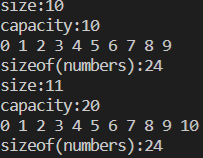
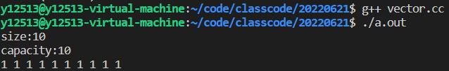

# std::string


```c++
#include <string>
```

C++风格的字符串，不用担心内存，做到自动分配和释放内存

## C++风格字符串 

```c++
std::string s1 = "hello"; 
std::string s2("world");
```


## 求取字符串长度

```c++
cout << s1.size() << endl; 
cout << s1.length() << endl;
```

```c++
#include <iostream>
#include <string>

using namespace std;

void test()
{
    string s1;
    cout << "s1.size() : " << s1.size() << endl
         << "s1.empty() : " << s1.empty() << endl;

    string s2("hello");
    cout << "s2.size() : " << s2.size() << endl
         << "s2.empty() : " << s2.empty() << endl;
}

int main()
{

    test();

    return 0;
}
```


## 字符串的遍历

```c++
for(size_t idx = 0; idx != s1.size(); ++idx) 
{ 
    cout << s1[idx] << " "; 
}
cout << endl;
```


## 字符串拼接

```c++
std::string s3 = s1 + s2; 
cout << "s3 = " << s3 << endl;
```


## 查找子串

```c++
size_t pos = s1.find("world");
```


## 截取子串

```c++
std::string substr = s1.substr(pos); 
cout << "substr = " << substr << endl;
```

## 示例

```c++
#include <iostream>
#include <string>
using std::cout;
using std::endl;
using std::string;
 
void test0() 
{
	string s1;
	cout << "s1:" << s1 << endl;
	cout << "s1.size():" << s1.size() << endl;
	cout << "s1.empty():" << s1.empty() << endl << endl;

	//将C风格字符串转换成C++风格字符串
	string s2("hello");
	cout << "s2:" << s2 << endl;
	cout << "s2.length():" << s2.length() << endl;
	cout << "s2.empty():" << s2.empty() << endl << endl;

	string s3("worldaaa", 5);
	cout << "s3:" << s3 << endl;

	cout << (s2 == s3) << endl;
	cout << (s2 != s3) << endl;

	cout << endl << "执行加法操作 " << endl;
	//字符串拼接操作
	//string s4 = s2 + "wuhan" + s3;
	string s4 = "wuhan" + s3 + s2 + 'X';
	cout << "s4:" << s4 << endl << endl;

	//字符串附加操作
	cout << endl << "执行append操作 " << endl;
	s2.append(s3);
	s2.append(3, 'a');
	s2.append(",wuhan");
	cout << "s2:" << s2 << endl;

	//将C++风格的字符串转换成C风格的字符串
	cout << endl << "转换成C风格字符串操作 " << endl;
	printf("s4:%s\n", s4.c_str());
	printf("s4:%s\n", s4.data());

	//遍历元素
	cout << endl << "C++风格字符串用下标访问某一个字符 " << endl;
	for(size_t idx = 0; idx < s4.size(); ++idx) {
		cout << s4[idx] << " ";
	}
	cout << endl;
	
    cout << endl << "C++风格字符串增强for循环 " << endl;
	//auto关键字表示自动进行推导
	//& 引用符号，直接操作元素本身；
	//如果没有使用引用，就会进行复制
	//冒号左边的是表示任一元素，右边的表示容器
	//    ch : s4
	for(auto & ch : s4) {
		cout << ch << " ";
	}
	cout << endl;

	//迭代器简单理解，就是指针
	cout << endl << "C++风格字符串迭代器访问 " << endl;
	auto it = s4.begin();
	while(it != s4.end()) {
		cout << *it << " ";
		++it;
	}
	cout << endl;

	cout << endl << "C++风格字符串进行子串截取操作" << endl;
	string s5 = s4.substr(5, 5);
	cout << "s5:" << s5 << endl;

	auto pos = s4.find("world");
	cout << "pos:" << pos << endl;
	pos = s4.find(s5);
	cout << "pos:" << pos << endl;


} 
 
int main(void)
{
	test0();
	return 0;
}

```


# std::vector

```c++
#include <vector>
```

vector是一类对象的集合

vector可以自动进行扩容操作,不需要担心内存不够


## 查看与插入

```c++
vector() : vector (allocator()) {}
```


```c++
void displayVector(const vector<int> & vec)
{
	cout << "size:" << vec.size() << endl;         //使用size来查看vector的大小
	cout << "capacity:" << vec.capacity() << endl; //使用capacity查看vector的容量
	for(auto & elem : vec) {
		cout << elem << " ";
	}
	cout << endl;
}
```


```c++
void test0() 
{
	vector<int> numbers;
	numbers.reserve(10);//预留空间,只开辟空间,不创建元素

	for(int idx = 0; idx < 11; ++idx) {
		numbers.emplace_back(idx);//在尾部插入元素
		displayVector(numbers);
		cout << "sizeof(numbers):" << sizeof(numbers) << endl;
	}
} 
```


当size == capacity时，如果还需要添加新的元素此时要进行扩容，直接申请 2 * capacity的新空间要原来空间的种的元素拷贝到新空间中释放原来的空间在新空间中添加新的元素




## 使用自定义类vector

```c++
class Point
{
public:
	Point(int ix = 0, int iy = 0)
		: _ix(ix), _iy(iy)
	{
		cout << "Point(int=0,int=0)" << endl;
	}

	Point(const Point &rhs)
		: _ix(rhs._ix), _iy(rhs._iy)
	{
		cout << "Point(const Point&)" << endl;
	}

	~Point() { cout << "~Point()" << endl; }

	void print() const
	{
		cout << "(" << _ix
			 << "," << _iy
			 << ")";
	}

private:
	int _ix;
	int _iy;
};

void displayVector(const vector<Point> &vec)
{
	cout << "size:" << vec.size() << endl;
	cout << "capacity:" << vec.capacity() << endl;
	for (auto it = vec.begin(); it != vec.end(); ++it)
	{
		it->print();
		cout << " ";
	}
	cout << endl;
}

void test2()
{
	vector<Point> points(10);
	displayVector(points);
}
```





empalace_back 是push_back的上位选择

```c++
void test3()
{
	vector<Point> points(10, Point(1, 2));
	cout << endl;
	points.push_back(Point(11, 12));
	//emplace_back可以传递可变参数
	//根据存放在容器中元素的类型的构造函数形式
	//进行对象的创建
	//用emplace_back替换push_back的作用
	points.emplace_back();
	points.emplace_back(11);
	points.emplace_back(11, 12); //更香
	displayVector(points);
}
```

