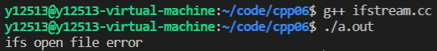
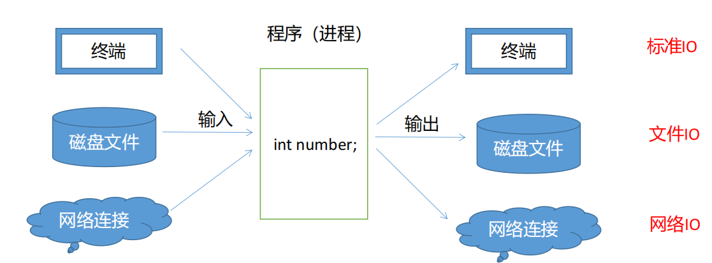

一切皆文件

# 输入输出的概念


**程序的输入**指的是从输入文件将数据传送给程序(内存)，**程序的输出**指的是从程序(内存)将数据传送给输出文件。


## “流”的概念


C++的 I/O发生在流中，**流**是字节序列。如果字节流是从设备（如键盘、磁盘驱动器、网络连接等）流向内存，这叫做**输入操作**。如果字节流是从内存流向设备（如显示屏、打印机、磁盘驱动器、网络连接等）这叫做**输出操作**。


## “流”类型


### 标准I/O


```c++
#include<iostream>
```

对系统指定的标准设备的输入和输出。即从键盘输入数据，输出到显示器屏幕。这种输入输出称为标准的输入输出

就是每天用的cin和cout，不多说了

~~还有底层实现，但我不想care~~


### 文件I/O


```c++
#include<fstream>
```


以外存磁盘文件为对象进行输入和输出，即从磁盘文件输入数据，数据输出到磁盘文件。以外存文件为对象的输入输出称为文件的输入输出


```c++
ifstream(); //文件输入流
explicit ifstream(const char *filename, openmode mode = in); 
explicit ifstream(const string &filename, openmode mode = in); 

ofstream(); //文件输出流 
explicit ofstream(const char *filename, openmode mode = out); 
explicit ofstream(const string &filename, openmode mode = out); 

fstream(); //文件流 
explicit fstream(const char *filename, openmode mode = in|out); 
explicit fstream(const string &filename, openmode mode = in|out);
```


```c++
#include<fstream>
#include<iostream>
#include<string>

using namespace std;

void test0(){
    ifstream ifs("text.txt"); //打开text文件到ifs
    if(!ifs.good()){          //如果打开文件失败
        cout << "ifs open file error" << endl;
        return;
    }
    
    string word;
    //输入流以空格或者换行符或者制表符作为分隔符
    while(ifs >> word){ //将文件流中的内容输入到word
        cout << word << endl;
    }
    
    ifs.close();//关闭文件流
}
```

如果当前目录下没有text.txt文件，会打开失败




### 串I/O

 

```c++
#include<sstream>
```

对内存中指定的空间进行输入和输出。通常指定一个字符数组作为存储空间（实际上可以利用该空间存储任何信息）


### 总结


