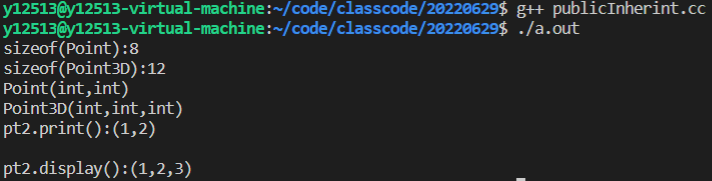
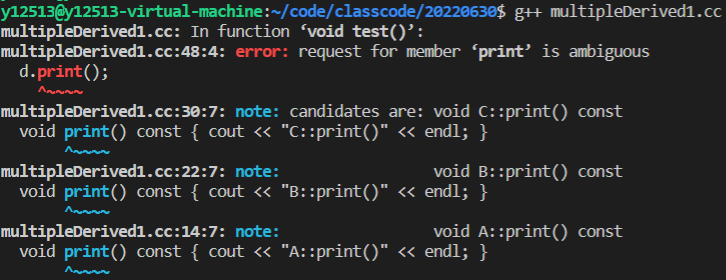
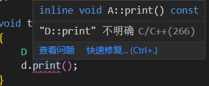
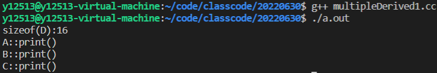
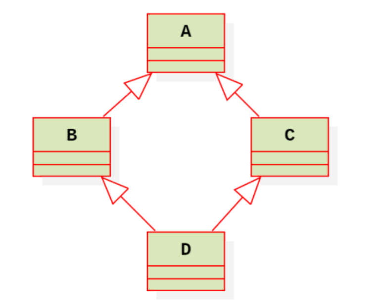

~~(套娃一样地使用类)~~

需求：

在现有类的基础上，增加新的功能的同时复用已有的功能

当然在C中就是增加函数，修改已有的函数之类的操作，C++中可以通过继承的方式增加新的实现


# 继承的定义                                     


通过继承，我们可以用原有类型来定义一个新类型，定义的新类型既包含了原有类型的成员，也能自己添加新的成员，而不用将原有类的内容重新书写一遍。原有类型称为**“基类”**或“父类”，在它的基础上建立的类称为**“派生类”**或**“子类”**。 


代码格式如下

```c++
class 派生类 
:public/protected/private 基类 
{
public:

protected:
    
private:
    
};
```


派生类创造的过程：

1.吸收基类的成员

2.改造基类的成员

3.添加自己的新成员


无法继承：

1.构造函数（包括拷贝构造函数）

2.析构函数

3.赋值运算符函数

4.operator new / delete函数

5.友元


# 三种继承方式


派生类继承了基类的全部成员变量和成员方法（除了构造和析构之外的成员方法），但是这些成员的访问属性，在派生过程中是可以调整的。


以之前的point为例，我们在创建point类时只有x，y两个维度

```c++
class Point
{
public:
	Point(int ix = 0, int iy = 0)
	: _ix(ix)
	, _iy(iy)
	{	cout << "Point(int,int)" << endl;	} 

	void print() const 
	{
		cout << "(" << _ix
			 << "," << _iy
			 << ")" << endl;
	}
protected://将其权限开放给派生类，在派生类内部直接访问
	int _ix;
	int getY() const 
    {
        return _iy;	
    }

private://只能在本类内部访问, 限制最严格
	int _iy;
};
```

现在要新加一个维度，使之成为3维


## 公有继承

又叫接口继承

| 继承方式 | 基类成员访问权限 | 在派生类中访问权限 | 派生类对象访问 |
| :------: | :--------------: | :----------------: | :------------: |
|          |      public      |       public       |   可直接访问   |
| 公有继承 |    protected     |     protected      |  不可直接访问  |
|          |     private      |    不可直接访问    |  不可直接访问  |


```C++
class Point3D
: public Point //公有继承,对于基类的非私有成员，在派生类内部访问权限不变
{			   //又叫接口继承
public:
	Point3D(int ix, int iy, int iz)
	: Point(ix, iy)
	, _iz(iz)
	{	cout << "Point3D(int,int,int)" << endl;	}

	void display() const
	{
		cout << "(" << _ix//protected
			 << "," << getY() //iy在point类中是private，无法直接访问，只能通过函数调用
			 << "," << _iz
			 << ")" << endl;
	}

private:
	int _iz;
};
```


可以看到public基类可以让派生类访问基类的的public函数


```c++
void test0() 
{
	cout << "sizeof(Point):" << sizeof(Point) << endl;
	cout << "sizeof(Point3D):" << sizeof(Point3D) << endl;
	
	Point3D pt2(1, 2, 3);
	cout << "pt2.print():";
	
    pt2.print();//public
	
    cout << endl;
	cout << "pt2.display():";
	pt2.display();
} 
```





## 保护继承


| 继承方式 | 基类成员访问权限 | 在派生类中访问权限 | 派生类对象访问 |
| :------: | :--------------: | :----------------: | :------------: |
|          |      public      |     protected      |  不可直接访问  |
| 保护继承 |    protected     |     protected      |  不可直接访问  |
|          |     private      |    不可直接访问    |  不可直接访问  |


```c++
class Point3D
: protected Point //保护继承,对于基类的非私有成员，在派生类内部访问权限都是protected
{		
public:
	Point3D(int ix, int iy, int iz)
	: Point(ix, iy)
	, _iz(iz)
	{	cout << "Point3D(int,int,int)" << endl;	}

	void display() const
	{
		cout << "(" << _ix//protected,基类非私有成员都是protected的
			 << "," << getY() //protected 
			 << "," << _iz
			 << ")" << endl;
	}

private:
	int _iz;
};
```


```c++
void test0() 
{
	cout << "sizeof(Point):" << sizeof(Point) << endl;
	cout << "sizeof(Point3D):" << sizeof(Point3D) << endl;
	
	Point3D pt2(1, 2, 3);
	cout << "pt2.print():";
	
    
    //pt2.print();       //即使是在point中为public ，在定义为protected后, error不能直接通过派生类对象进行调用
	
    
    cout << endl;
	cout << "pt2.display():";
	pt2.display();
} 

int main(){
    test0();
       
    return 0;
}
```


## 私有继承


| 继承方式 | 基类成员访问权限 | 在派生类中访问权限 | 派生类对象访问 |
| :------: | :--------------: | :----------------: | :------------: |
|          |      public      |      private       |  不可直接访问  |
| 私有继承 |    protected     |      private       |  不可直接访问  |
|          |     private      |    不可直接访问    |  不可直接访问  |


```c++
class Point3D
: private Point //私有继承,对于基类的非私有成员，在派生类内部访问权限private
{			   
public:
	Point3D(int ix, int iy, int iz)
	: Point(ix, iy)
	, _iz(iz)
	{	cout << "Point3D(int,int,int)" << endl;	}

	void display() const
	{
		cout << "(" << _ix//private
			 //<< "," << _iy
			 << "," << getY() //private
			 << "," << _iz
			 << ")" << endl;
	}

private:
	int _iz;
};
```


使用上同protected，但是在被继承时情况有所不同


```c++
class Point4D
: Point3D
{

	void show() const
	{
		cout << _ix      //error
			 << getY();  //error
	}
};
```

如果基类是protected则可以被继承，但现在是private，属于是变成了point3D的private对象，则在继承时无法被访问


## 总结


基类成员在派生类外部能访问多少？

在派生类外部能够直接访问的是公有继承自基类（：public 基类）的公有成员（public：），其他成员一律不能访问


有了三种不同的继承方式后，基类的成员在派生类内部的访问权限是什么样的？

1.基类的私有成员，不管以哪种方式继承，在派生类内部不可访问 

2.基类的非私有成员，不管以哪种方式继承，在派生类内部都可以直接访问 


保护继承与私有继承的区别：

对于保护继承，如果继承层次有多层时，每一层次都能在类内部直接访问继承体系中的任一成员；

但私有继承不行，一旦某一层采用了私有继承，这种访问方式就会被打断


公有继承称为接口继承，接口可以继续对外提供服务

保护继承和私有继承又称为实现继承，不能在类之外直接访问


*微软的COM组件的继承层次高达百层*


# 派生类对象的创建

构造函数无法被继承

那么定义派生类时要自己定义构造函数，要注意什么


## 如果派生类有显式定义构造函数，而基类没有显示定义构造函数


则创建派生类的对象时，派生类相应的构造函数会被自动调用，此时都自动调用了基类缺省的无参构造函数。

```c++
class Base 
{
pulbic: 
    Base() { 
        cout << "Base()" << endl; 
    } 
};

class Derived : 
public Base 
{
public: 
    Derived(long derived) 
    : _derived(derived) 
    { 
        cout << "Derived(long)" << endl; 
    }
    
    long _derived; 
};

void test() { 
    Derived d(1); 
}

```


## 如果派生类没有显式定义构造函数而基类有显示定义构造函数


则基类必须拥有默认构造函数


## 如果派生类有构造函数，基类有默认构造函数


则创建派生类的对象时，基类的默认构造函数会自动调用

如果你想调用基类的有参构造函数，必须要在派生类构造函数的初始化列表中显示调用基类的有参构造函数


## 如果派生类和基类都有构造函数，但基类没有默认的无参构造函数，即基类的构造函数均带有参数


则派生类的每一个构造函数必须在其初始化列表中显示的去调用基类的某个带参的构造函数

如果派生类的初始化列表中没有显示调用则会出错，因为基类中没有默认的构造函数


## 总结

必须将基类构造函数放在派生类构造函数的初试化列表中，以调用基类构造函数完成基类数据成员的初始化。


派生类构造函数实现的功能，或者说调用顺序为：

1. 完成对象所占整块内存的开辟，由系统在调用构造函数时自动完成。

2. 调用基类的构造函数完成基类成员的初始化。

3. 若派生类中含对象成员、const成员或引用成员，则必须在初始化表中完成其初始化。

4. 派生类构造函数体执行。


# 派生类对象的销毁


当派生类对象被删除时，派生类的析构函数被执行。

析构函数同样不能继承，因此，在执行派生类析构函数时，基类析构函数会被自动调用。

执行顺序是先执行派生类的析构函数，再执行基类的析构函数，这和执行构造函数时的顺序正好相反。


当考虑对象成员时，继承机制下析构函数的调用顺序：

1.先调用派生类的析构函数

2.再调用派生类中成员对象的析构函数

3.最后调用普通基类的析构函数


# 多基继承

（java和C# 都没有多重继承 只有单重继承）

算是C++的坑，所以java没有学


派生类可以继承多个基类

```c++
class student{};

class teacher{};

class school
:public student 
,public teacher
{
    
}

```


继承多个类时要一行一行写，如果写

```c++
:public student , techer
```

student为公有（public）继承，teacher则为默认的私有（private）继承


## 成员名访问冲突的二义性


多基继承时，不同的基类中有重复的成员名的情况

```c++
class A {
public:
	void print() const {	cout << "A::print()" << endl;}

	int _a;
};

class B {
public:
	void print() const {	cout << "B::print()" << endl;}

	int _b;
};
 
class C {
public:
	void print() const {	cout << "C::print()" << endl;}

	int _c;
};

class D
: public A
, public B 
, public C
{
public:
	int _d;
};
```


这时ABC类中都有同名的print()函数


```c++
void test() 
{
    D d;
    d.print();
} 
```

直接调用print()编译时会报错



报错会明确指出三个类中都有print()




*不过现在编译器更智能一点*


### 解决方法

使用作用域限定符::来明确调用的是哪个类的print()


```c++
void test0()
{
	D d;

	d.A::print();
	d.B::print();
	d.C::print();
}
```




## 存储二义性的问题


继承的多个基类中有两个基类以上是以同一个类为基类 （好√8拗口，直接上图）



D以BC为基类，BC又以A为基类，这种棱形继承


### 解决方法


使用虚拟继承（要到多态才能解释，这里就放个示例）


```c++
class A {
public:
	void print() const 
    {	cout << "A::print()" << endl; }

	long _a;
};

class B 
:virtual 
public A  //虚拟继承A
{
public:
	void show() const 
    {	cout << "B::show()" << endl;}

	long _b;
};
 
class C 
:virtual 
public A //虚拟继承A
{
public:
	void display() const 
    {	cout << "C::display()" << endl;}

	long _c;
};

class D
: public B
, public C
{
public:

	long _d;
};

void test(){
    D d;
    d.print();//OK
}
```


# 基类与派生类的互相转换


基类与派生类的关系:

A is B, B is A


安全的转化方向：

1.将基类指针指向派生类对象

2.将基类引用绑定到派生类对象

3.将派生类对象赋值给基类对象


```c++
class Base
{
public:
	Base(int base = 0)
	: _base(base)
	{	cout << "Base(int=0)" << endl;	}

	void print() const 
	{	cout << "Base::_base:" << _base << endl;	}

	~Base() {	cout << "~Base()" << endl;	}

protected:
	int _base;
};


class Derived
: public Base
{
public:
	Derived()
	: Base()//基类部分的初始化需要在派生类构造函数的初始化列表中进行
	, _derived(0) //即使不写，也会自动调用基类默认构造函数
	{	cout << "Derived()" << endl;	}

	Derived(int base, int derived)
	: Base(base)//基类部分的构造，是直接通过类名来调用构造函数
	, _derived(derived) 
	{
		cout << "Derived(int,int)" << endl;
	}

	void display() const
	{	
		print();
		cout << "Dervived::_derived:" << _derived << endl;	}

	~Derived() {	cout << "~Derived()" << endl;	}

private:
	int _derived;
};
```


## 基类与派生类的赋值


```c++
void test0() 
{
	Base base(1);
	Base * pbase = &base;
	pbase->print();
	cout << endl;

	Derived d(11, 12);
	d.display();
	cout << endl;

	cout << "\n派生类对象赋值给基类对象:" << endl;
	base = d;//ok,  base.operator=(d);// const Base & rhs = d;
	base.print();
	cout << endl;

	d = base;//error

} 
```


## 基类与派生类的引用


```c++
void test0() 
{
	Base base(1);
	Base * pbase = &base;
	pbase->print();
	cout << endl;

	Derived d(11, 12);
	d.display();
	cout << endl;

	pbase = &d;//ok, 基类指针指向派生类对象
	cout << "基类指针指向派生类对象:" << endl;
	pbase->print();
	cout << endl;

	Derived * pderived = &d;
	pderived->display();
	cout << endl;

	cout << "派生类指针指向基类对象:" << endl;
	pderived = (Derived*)&base;//ok, 这绝对是不安全的, 有错，但是编译器没有提示，不能这样写
	pderived->display();       //编译虽然能通过的，但有运行时错误

	cout << "\n将基类引用绑定到派生类对象:" << endl;
	Base & refBase = d;//ok
	refBase.print();

	//Derived & refDerived = base;//error
} 
```


## 基类与派生类的转换


dynamic_cast


向下转型：基类指针转换成派生类指针    不安全的

向上转型：派生类指针转换成基类指针    安全的


```c++
void test0() 
{
	Base base(1);
	Base * pbase = &base;
	pbase->print();
	cout << endl;

	Derived d(11, 12);
	d.display();
	cout << endl;

	cout << "\n使用dynamic_cast:" << endl;
	Base * pbase2 = dynamic_cast<Base*>(&d);
	pbase2->print();

	Derived * pderived2 = dynamic_cast<Derived*>(&base);//error
	pderived2->display();

} 
```


# 派生类对象间的复制控制


拷贝构造函数也是不继承的


总原则：基类部分拷贝基类部分，派生类部分拷贝派生类部分


派生类没有显示定义复制控制函数，基类部分的复制控制操作会自动执行

派生类有显示定义复制控制函数，基类部分的复制控制不会再自动进行，必须要手动调用，否则只会复制派生类部分，基类部分会被忽略


