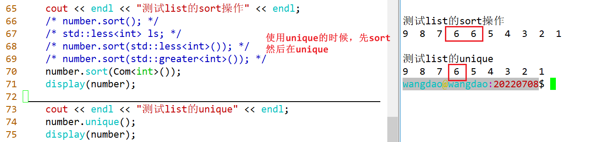
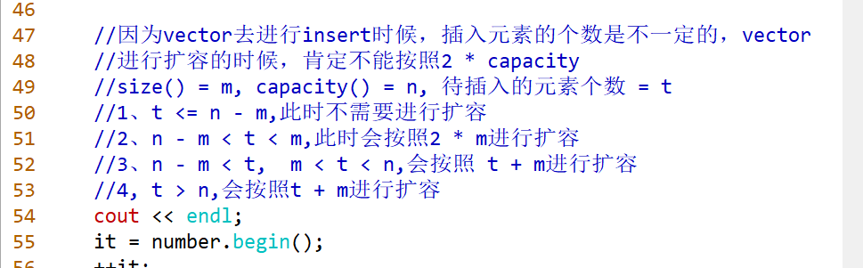
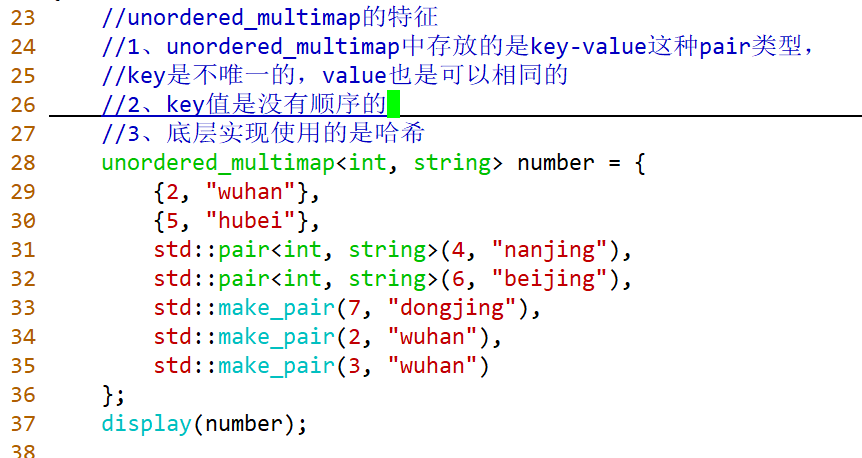

## C++Day19

### 一、STL的六大组件

1、容器：是用来存数据的。数据结构（学习的重点）

- 序列式容器   vector、list
- 关联式容器  set、map
- 无序关联式容器  unordered_set、unordered_map
- 容器适配器  stack、queue

2、迭代器   容器与算法之间的一个桥梁。看成是C语言中的指针，广义的指针。

3、算法   就是函数，用来操作容器中的元素。通用性、泛型

4、适配器   做适配作用。

5、函数对象（仿函数）：做定制化操作的。

6、空间配置器：进行空间申请与释放。

程序 = 数据结构 + 算法。


|     容器     | 数据结构 |
| :----------: | :------: |
|   array[]    | 静态数组 |
|    vector    | 动态数组 |
|    deque     | 双端队列 |
| forward_list |  单链表  |
|     list     | 双向链表 |
|     set      |   集合   |
|     map      |  哈希表  |


### 二、序列式容器的基本使用


#### 1、初始化的方式


```c++
void test(){
    vector<int> number0(10);//默认传入10个0
    
    vector<int> number1(10, 2);//传入10个2
    
    int arr[10] = {1,2,3,4,5,6,7,8,9,7};
    vector<int> number2(arr, arr + 10);//将arr数组传入
    
    vector<int> number3 = {1,2,3,4,5,6,7,8,9};//直接初始化  
}
```


#### 2、遍历的方式


使用下标进行遍历

```c++
for(size_t idx = 0; itx != number.size(); ++idx){
    number[idx];
}
```


使用迭代器遍历

```c++
vector<int>::iterator it;//定义一个迭代器 ，本质是一个指针

for(it = number.begin(); it != number.end(); ++it){  //使用迭代器it遍历number
    *it;    
}
```


auto

```c++
for(auto &elem : number){
    elem;
}
```

[^&区分取地址与引用：&前面有变量类型为引用，无则为取地址]: 


总结：vector、deque、list三种序列式容的初始化是完全一样的，vector与deque的四种遍历方式是一样的，但是**list不支持下标访问**，毕竟是链表

其他的三种遍历方式都是一样。


##### 2.1通用的遍历函数

可以写一个display()函数 给序列式容器以及set使用

```c++
template <typename Container>
void dispaly(const Container &con){
    for(auto &elem : con){
        cout << elem << " ";
    }
    cout << endl;
}
```


#### 3、在尾部进行插入与删除


#### 4、在头部进行插入与删除（vector不支持）


#### 5、为什么vector不支持在头部进行插入与删除呢？

因为vector是一端开口的，如果在头部进行插入与删除的话，需要将所有的元素进行挪动，时间复杂度是非常高的O(N)。

STL源码的路径：


C++的头文件的位置：/usr/include/c++/

自己安装的第三方库的头文件位置：/usr/local/include


匹配大括号 shift + %

```C++
//typename表明是一个类型
typedef typename _Alloc_traits<_Tp, _Allocator>::allocator_type  allocator_type;

class vector
{
  typedef _Tp value_type;
  typedef value_type* pointer;
  typedef const value_type* const_pointer;
  typedef value_type* iterator;
  typedef const value_type* const_iterator;
  typedef value_type& reference;
  typedef const value_type& const_reference;
  typedef size_t size_type;
  typedef ptrdiff_t difference_type;
};

vector<int>::value_type  ;
map<int, string>::value_type ;
//类型萃取
```

#### 6、vector的原理图


**vector的下标访问运算符与at函数之间的区别？**

at底层会进行范围检查，更加安全一些，但是下标访问运算符是没有进行安全检查的。


#### 7、deque的原理图

迭代器可以看成是一个广义的指针，可以是类似C语言中的裸指针，也可以是重载了运算符符的类（包括裸指针所能使用的所有运算符）


中控器、中控器数组的大小


deque是由一些小片段组成的，片段内部是连续的，但是片段与片段之间是不连续，需要通过中控器进行管理。


#### 8、vector的insert操作

有可能会发生迭代器失效，当我们进行insert的操作的时候，不知道每次插入元素的个数，在插入过程之中，有可能容量不够用，这样会导致**底层会进行扩容**，而迭代器还是指向老的空间的位置，所以下一次再使用该迭代器的时候，该迭代器指向的是老的空间，所以就报错。为了解决这个问题，每次使用迭代器的时候，都**进行重新置位**就可以了。


#### 9、vector的删除


#### 10、序列式容器元素的清空与空间的回收


## C++Day20

### 一、问题回顾

1、序列式容器的初始化方式有哪几种？序列式容器的遍历方式有哪几种？

2、vector为何不支持在头部进行插入与删除？

3、vector的类继承图是怎样的？vector实现原理？

4、deque的类继承图怎么样的？deque元素是不是连续的？

5、序列式容器的insert插入，会不会有什么安全隐患？vector进行insert迭代器失效的原因是什么，如何解决？


### 二、list的特殊操作

#### unique的使用

unique是可以去除连续重复元素。基本操作是：先将元素进行排序，然后在使用unique进行去重。




#### sort的使用

可以使用std::less或者std::greater进行升序排列或者降序排列。

std::less是一个类模板，其中重载了函数调用运算符，等价于重载了operator<

std::greater是一个类模板，其中重载了函数调用运算符，等价于重载了operator>

```C++
template <typename T>
struct less
{
  bool  operator()(const T &lhs, const T &rhs) const
  {
      return lhs < rhs;
  }
};
//等价于实现了operator<
```


#### splice的使用

如果是两个链表之间进行splice操作的话，可以将另外一个链表B中的某个，某一串，所有元素都移动到A链表中。但是，注意：可以操作同一个链表，但是注意不要有交叉。


#### vector使用insert扩容的原理




```C++
struct Record
{
    string  _word;
    int _fre;
}

class Dictionary
{
  vector<Record> _vec;  
};

//the 100
//ab  1

sort()
```


### 三、关联式容器

```C++
template< class InputIt >
set( InputIt first, InputIt last, const Allocator& alloc)
: set(first, last, Compare(), alloc) {}

//C++11 委托构造函数
```


#### 1、set的使用

##### 1.1、基本特征


##### 1.2、set不支持下标访问


##### 1.3、set是不支持修改的


代码调整的步骤

1、ctrl + v  2、按j  3、shift + i  4、可以按tab或者使用空格键  5、esc

另外一种将windows下面代码拷贝到Linux下面来，并且去进行调整

1、shift +  insert  2、gg  3、shift + v  4、shift + g  5、 =


Linux与windows小文件的传输

```C++
sz +  文件名字
rz 
    
//安装rz  sz
sudo apt install lrzsz
```

##### 1.4、针对于自定义类型（重点）

首先应该找相应std::less的实现版本（针对于自定义类型的），此时需要进行模板的特化；如果std::less的特化版本没有实现，就去找小于符号(operator<)；如果小于符号也没有写，就需要自己定义一个类，该类具有比较的含义。


#### 2、multiset的使用

##### 2.1、基本特征


##### 2.2、特殊函数的使用


##### 2.3、insert函数

multiset中插入元素的时候，肯定是可以插成功的，所以返回值可以不需要特殊检查。

##### 2.4、不支持下标访问，不支持修改


#### 3、map的使用

##### 3.1、map的基本特征


##### 3.2、map的插入


##### 3.3、map的下标访问（重点）


**总结：map的下标访问，具有查找的功能，具有插入的功能，还具有修改的功能。**

##### 3.4、insert插入的时候，三种pair的形式


##### 3.5、map的下标访问（针对于自定义类型）


#### 4、multimap的使用

##### 4.1、multimap的特征


##### 4.2、multimap的insert

multimap的插入肯定是可以成功，返回类型就不是一个pair。

##### 4.3、multimap是不支持下标的


## C++Day21

### 一、问题回顾

1、list的特殊操作？unique、sort、reverse、merge、splice

2、关联式容器有那几个？

3、关联式容器的基本操作：查找、插入、删除、下标、修改、自定义类型


### 二、无序关联式容器

数据结构使用的是哈希


装载因子/装填因子   = （元素的个数）/表长    < 1  [0.5, 0.75]。

数组可以看成是一个完美的哈希。

#### 1、unordered_set的使用


#### 哈希函数的设计


#### 函数对象的形式


#### equal_to的特化版本


#### 函数重载的版本


## C++Day22

### 一、无序关联式容器

#### 1、unordered_set的使用

##### 1.1、初始化


##### 1.2、针对于自定义类型

需要实现std::hash与std::equal_to，都可以使用两种方法，模板的特化或者函数对象的方式，当然std::equal_to等价于比较两个Point是不是相等，所以可以直接重载等号operator==。


#### 2、unordered_multiset的使用


#### 3、unordered_map的使用

##### 3.1、基本特征


##### 3.2、查找操作


##### 3.3、插入操作


##### 3.4、支持下标访问（重点）

下标具有查找、插入、修改的功能。


##### 3.5、针对于自定义类型


#### 4、unordered_multimap的使用

##### 4.1、初始化



##### 4.2、不支持下标访问


```C++
vector<int> vec;
for(size_t idx = 0; idx != 10000000; ++idx)
{
    vec.push_back(idx);//频繁进行扩容，元素存在堆上
}

int a = 10;
double b = 22.22;
a = b;

Point pt(1, 2);
int b = 10;
pt = b;
Point pt = 10;//int --- > Point  隐式转换  Point(10, 0)--->Point

int c = pt;//Point ---> int   自定义类型向其他类型转换（类型转换函数）

//类型转换函数
operator  int()
{
    return xxx;
}
```


### 二、容器该如何选择

序列式容器三个  vector、deque、list、array、forward_list

关联式容器四个：set、multiset、map、multimap

无序关联式容器四个：unordered_set、unordered_multiset、unordered_map、unordered_multimap

容器适配器有三个：stack、queue、priority_queue

#### 1、时间复杂度（查找的）

如果时间复杂度比较低，首先想到的是无序关联式容器，底层使用的是哈希（O(1)）；时间复杂度是O（logN）,首先选择的是关联式容器。


#### 2、如果支持下标访问

map、unodered_map、deque、vector


#### 3、迭代器的类型

随机访问迭代器 ：vector、deque

双向迭代器：list、关联式容器

前向迭代器：无序关联式容器


#### 4、元素能否重复

不能重复   set、unodered_set、map、unordered_map  文本查询作业中  map<string, set<int>>

元素存储的时候，是不是有顺序：关联式容器


#### 5、如果容器没有迭代器

如果一个容器没有迭代器，可以是容器适配器三个，stack、queue、priority_queue


### 三、优先级队列

```C++
template<
    class T,
    class Container = std::vector<T>,
    class Compare = std::less<typename Container::value_type>
> class priority_queue;

typename Container::value_type     typename vector::value_type
//类型萃取
```

优先级队列是没有迭代器的，所以这种遍历方式是不行的。


#### 原理


#### 遍历的方式


#### 针对于自定义类型

需要实现std::less，实现方式有三种，将std::less针对Point进行特化，或者写成函数对象的形式；或者针对Point实现小于符号（operator<）


### 四、迭代器

类型适应：派生类可以适用于基类。

随机访问迭代器的功能最多，可以适用于双向迭代器、前向迭代器、输入与输出迭代器。

```C++
template< class InputIt, class OutputIt >
OutputIt copy( InputIt first, InputIt last, OutputIt d_first );
```

#### ostream_iterator源码

```C++
class ostream_iterator
{
public:
    //ostream_iterator<int> osi(cout, "\n");
     ostream_iterator(ostream_type& __s, const _CharT* __c) 
    : _M_stream(&__s)
    , _M_string(__c) 
    {}
    
    ostream_iterator<_Tp>& operator=(const _Tp& __value) 
    { 
    *_M_stream << __value;
    if (_M_string) *_M_stream << _M_string;
    return *this;
  }
    
   ostream_iterator<_Tp>& operator*() { return *this; }
  ostream_iterator<_Tp>& operator++() { return *this; } 
  ostream_iterator<_Tp>& operator++(int) { return *this; } 
private:
  ostream_type* _M_stream;
  const _CharT* _M_string;   
};

_M_stream = &cout;
__c = "\n";


template <class _InputIter, class _OutputIter>
inline _OutputIter copy(_InputIter __first, _InputIter __last,
                        _OutputIter __result) {
  __STL_REQUIRES(_InputIter, _InputIterator);
  __STL_REQUIRES(_OutputIter, _OutputIterator);
  return __copy_aux(__first, __last, __result, __VALUE_TYPE(__first));
}

template <class _InputIter, class _OutputIter, class _Tp>
inline _OutputIter __copy_aux(_InputIter __first, _InputIter __last,
                              _OutputIter __result, _Tp*) {
  typedef typename __type_traits<_Tp>::has_trivial_assignment_operator
          _Trivial;
  return __copy_aux2(__first, __last, __result, _Trivial());
}


trivial:平凡的、琐碎的。内置类型，没有自己实现构造函数、析构函数、拷贝构造函数、赋值运算符函数的类
    
noTrivial:不平凡、不琐碎。自定义类型，自己实现构造函数、析构函数、拷贝构造函数、赋值运算符函数的类
    
template <class _InputIter, class _OutputIter>
inline _OutputIter __copy_aux2(_InputIter __first, _InputIter __last,
                               _OutputIter __result, __false_type) {
  return __copy(__first, __last, __result,
                __ITERATOR_CATEGORY(__first),
                __DISTANCE_TYPE(__first));
}

template <class _InputIter, class _OutputIter, class _Distance>
inline _OutputIter __copy(_InputIter __first, _InputIter __last,
                          _OutputIter __result,
                          input_iterator_tag, _Distance*)
{
  for ( ; __first != __last; ++__result, ++__first)
    *__result = *__first;
  return __result;
}

//cppreference提供的
template<class InputIt, class OutputIt>
OutputIt copy(InputIt first, InputIt last, OutputIt d_first)
{
    while (first != last) {
        *d_first++ = *first++;
    }
    return d_first;
}

//copy(number.begin(), number.end(), osi);
__first = number.begin();
__last = number.end();
__result = osi;

template <class _InputIter, class _OutputIter>
inline _OutputIter copy(_InputIter __first, _InputIter __last,_OutputIter __result)
{
    for ( ; __first != __last; ++__result, ++__first)
        *__result = *__first;
    return __result;
}

    *osi  =  3;
                 last
1, 3, 5, 7, 9, 8
                 f 
                     
ostream_iterator<_Tp>& operator=(const int& __value)
{ 
    *_M_stream << __value;//cout << 1
    if (_M_string) *_M_stream << _M_string;//cout << "\n"
    return *this;
}
cout << 1 << "\n";
cout << 3 << "\n";//endl "\n"

int *pInt = new int(10);
const char *pstr = "hello";
cout << pstr << endl;
cout << *pstr << endl;
cout << *pInt << endl;
```


#### 代码调试的方法

1、打印的方式（cout、printf）

2、gdb     -g  调试选项

list、b（打印断点）、info b(查看断点信息)、print + 变量名字、r(让程序运行起来)、next/n、continue/c、

step/s 、bt(打印堆栈信息)

#### istream_iterator源码

```C++
class istream_iterator
{
 public:
     istream_iterator(istream_type& __s) //__s = cin
      : _M_stream(&__s) 
      { 
          _M_read(); 
      }
     void _M_read() 
     {
         _M_ok = (_M_stream && *_M_stream) ? true : false;
         if (_M_ok) 
         {
             *_M_stream >> _M_value;//cin >> _M_value = 2
             _M_ok = *_M_stream ? true : false;
         }
     }
    
     reference operator*() const { return _M_value; }
    istream_iterator& operator++()
    { 
        _M_read(); 
        return *this;
    }
  istream_iterator operator++(int)  {
    istream_iterator __tmp = *this;
    _M_read();
    return __tmp;
  }
 private:
  istream_type* _M_stream;
  _Tp _M_value;
  bool _M_ok;

};

copy(isi, istream_iterator<int>(), std::back_inserter(vec));

__first = isi;
__last = istream_iterator<int>();
__result = std::back_inserter(vec);

template <class _InputIter, class _OutputIter>
inline _OutputIter copy(_InputIter __first, _InputIter __last,_OutputIter __result)
{
    for ( ; __first != __last; ++__result, ++__first)
        *__result = *__first;
    return __result;
}

*__result = 2;

template <class _Container>
inline back_insert_iterator<_Container> back_inserter(_Container& __x)
{
  return back_insert_iterator<_Container>(__x);
}


}

template <class _Container>
class back_insert_iterator {
public:
    explicit back_insert_iterator(_Container& __x) 
    : container(&__x) {}
    
     back_insert_iterator<_Container>& operator*() { return *this; }
  back_insert_iterator<_Container>& operator++() { return *this; }
  back_insert_iterator<_Container>& operator++(int) { return *this; }
    
   back_insert_iterator<_Container>& 
   operator=(const typename _Container::value_type& __value) 
    { 
    container->push_back(__value);
    return *this;
  }
    
protected:
  _Container* container;

};

//重载的等号，判断两个istream_iterator对象是不是相等的。
template <class _Tp, class _CharT, class _Traits, class _Dist>
inline bool 
operator==(const istream_iterator<_Tp, _CharT, _Traits, _Dist>& __x,
           const istream_iterator<_Tp, _CharT, _Traits, _Dist>& __y) {
  return __x._M_equal(__y);
}
__x = isi;
__y = istream_iterator<int>();

bool _M_equal(/* this */,const istream_iterator& __x) const
{ 
    //__x = istream_iterator<int>();
    return (this->_M_ok == __x._M_ok) && (!_M_ok || _M_stream == __x._M_stream); 
}
```


#### 迭代器适配器

back_insert_iterator类模板，back_inserter函数模板，返回类型是back_insert_iterator。

front_insert_iterator类模板，front_inserter函数模板，返回类型是front_insert_iterator。

insert_iterator类模板，inserterer函数模板，返回类型是insert_iterator。