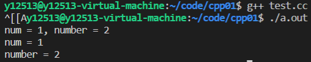

# CPP 前置

1.程序后缀 .cc(linux下) or .cpp(windows下)

2.编译指令

$ gcc *.cc [-o name]

3.instal

$sudo apt install g++

# 命名空间

## namespace 

```c++
namespace name
{
int number = 1;

void test(){
    
}//end of tese
}//end of name 
```

==在命名空间中定义的统称为实体（包括变量和函数）==

==命名空间的代码顶格，不需要缩进==

## 使用命名空间

三种方式

### 使用作用域限定符:: ，限定符前为命名空间的名字，后面为命名空间中的实体

```c++
namespace name
{
int number = 1;

void test(){
    
}//end of tese
}//end of name 

int main(){
    name::number = 1;
    name::test();
}
```

### 用using编译指令一次性把命名空间中的实体全部引入

```c++
namespace name
{
int number = 1;

void test(){
    
}//end of tese
}//end of name 

using namespace name;

int main(){
    number = 1;
    test();
}
```

### 可以使用using对单个实体进行使用

```c++
#include<iostream>
//using namespace std;
using std::cout;//使用std里的cout
using std::endl;//使用std里的endl

int main(){
    cout<<"hello world"<<endl;
    
    return 0;
}
```

可以只using std里的cout和endl这两个实体（反正其他没用的话）

## using 会造成的定义冲突

```c++
#include<iostream>

using namespace std;

void cout(){ //哎呀，我不知道std里面有cout耶，哎嘿
    printf("\n");
}

int main(){
    cout();
    
    return 0;
}
```


'cout' is ambiguous

因为命名空间std中已经包含了我们常用的cout，此时再另外声明会出现问题

所以在不知道命名空间中会出现什么实体的情况下大力推荐使用第三种using

## 命名空间的嵌套使用

可以在一个命名空间中再namespace一个命名空间

```c++
namespace wd
{

int num = 1;
    
void display(){
    printf("num = %d\n", num);
}    

namespace cteam
{
int number = 2;

void display(){
    printf("number = %d\n", number);
}
    
}//end of namespace cteam
}//end of namespace wd
```

当然调用实体的时候要一层一层调用(就像写快递地址一样)

```c++
int main(){
    printf("num = %d, number = %d\n", wd::num, wd::cteam::number);
    
    wd::display();
    wd::cteam::display();
    
    return 0;
}
```



## 命名空间是否只可以定义一次

函数是只能定义一次

```c++
int add(int，int)；
int add(int a,int b){
    return a+b;
}
```

命名空间也是这样吗，当然不是

```c++
namespace wd
{

int num = 1;
    
void display(){
    printf("num = %d\n", num);
}    

namespace cteam
{
int number = 2;

void display(){
    printf("number = %d\n", number);
}
    
}//end of namespace cteam
}//end of namespace wd

namespace wd
{
int number=3;
    
void show(){
    printf("number = %d\n",number);
}
    
}//end of namespace wd
```

再次定义命名空间会将新的命名空间中定义的实体加入进去

命名空间就像黑洞，可以无限吸收新的实体

## 匿名空间

c++作为c的超集当然兼容c的头文件

那么调用c的库函数时会存放在==匿名空间==中

```c++
::printf();
```

模块：单个c，c++文件

但是匿名空间中的实体也只能在本模块中使用

同理静态变量 static ，静态函数也只能在本模块中调用

全局变量extern则可以跨模块调用，但是匿名空间的全局变量也只能在本模块中调用

# const关键字

上面提到过静态变量static，全局变量extern

还剩下一个常量const

const修饰的常量不能修改其值，使这个变量具有只读属性，定义的时候一定要赋值，否则会报错

## const修饰指针

有三种情况

### const int *P

```c++
int a = 1;
int b = 10;
const int *p = &a;
p = &b;  //ok     可以改变指向
*p = 100;//error  不可以改变指针所指变量的值
```

### int * const p 

```c++
int a = 1;
int b = 10;
int * const p = &a;
p = &b;  //error 不可以改变指向
*p = 100;//ok    可以改变指针所指变量的值
```

### int const * const p

```c++
int a = 1;
int b = 10;
int const * const p = &a;
p = &b;  //error
*p = 100;//error
```

# NEW / DELETE

## c++中申请内存空间

c语言中使用malloc / calloc申请内存，使用free释放内存

c++中使用new申请内存，使用delete释放内存

==都需要成对使用，防止发生内存泄露==

```c++
void test(){
    int *p = new int(10);//给*p赋值10
    delete p;//回收p
    
    //上面是只有单个变量，下面演示数组
    
    int * arr = new int[10]();//小括号内填值进行初始化
    delete [] arr;//回收整个数组的空间，需要加[]，不加会报错
}
```

## 与c的异同

相同点：

都用来申请堆空间

必须成对出现，否则会发生内存泄漏

不同点：

new/delete是C++的表达式，malloc/free是C的库函数

new在开辟空间时可以初始化空间，malloc只能申请空间，不能初始化

# 引用REFERENCE

reference 本质上就是一个变量的别名。

与某一个实体绑定到一起，对引用的修改就是对变量的修改

引用本身不能单独存在（虚空索敌吗），必须绑定一个实体，一经绑定不能改变对象

**引用的底层实现是指针常量**，他的出现就是减少指针的使用


定义 类型 & ref =变量

&的用法：

​    ==取地址==

​    按位与

​    引用符号


## 引用作为函数的参数

```c++
void swap(int & x, int & y){
    int tmp = x;
    x = y;
    y = temp;
}
//调用函数时可以直接作用于x，y 交换变量的值
```

优势：直观，不需要为参数开辟额外的空间，不需要进行复制，这样提高程序的执行效率

## 引用作为函数的返回值

```c++
int arr[5] = {1, 2, 3, 4, 5};

int & getVal(int i){
    return arr[i];
}//会直接调用全局变量，不会进行复制，从而节省开销

int main(){
    getVal(1) = 10;//直接对arr[1]进行赋值
    
    return 0;
}
```

与普通函数返回值对比，没有复制开销

这种写法返回的变量一定要大于函数的生命周期

## 不能返回局部变量的引用

```c++
int & test(){
    int number = 1;
    return number;
}
```

编译时会有警告

运行时会发生==段错误==

## 不要轻易返回一个堆空间变量（指针）的引用

返回堆空间引用，但是有内存泄漏，如果非要这么做，必须有内存回收机制

```c++
int & func2(){
    int *p = new int(10);
    return *p;
}
```

调用的人如果不知道返回的是指针100%会发生内存泄漏（星空：完全救不回来）

## 引用与指针的异同

既然引用的底层实现是常量指针，那么引用与指针的异同是什么？

### 相同点：

都是地址的概念；

指针指向一块内存，它的内容是所指内存的地址；引用是某块内存的别名。

### 区别：

指针是一个实体，而引用仅是个别名；

引用使用时无需解引用(*)，指针需要解引用；

引用只能在定义时被初始化一次，之后不可变；指针可变；

引用没有 const，指针有 const；

引用不能为空，指针可以为空；

“sizeof 引用”得到的是所指向的变量(对象)的大小，而“sizeof 指针”得到的是指针本身(所指向的变量或对象的地址)的大小；

指针和引用的自增(++)运算意义不一样；

从内存分配上看：程序为指针变量分配内存区域，而引用不需要分配内存区域。

# 强制转换

